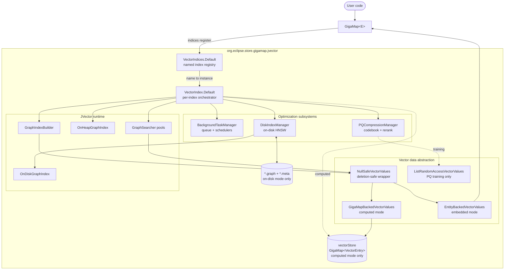
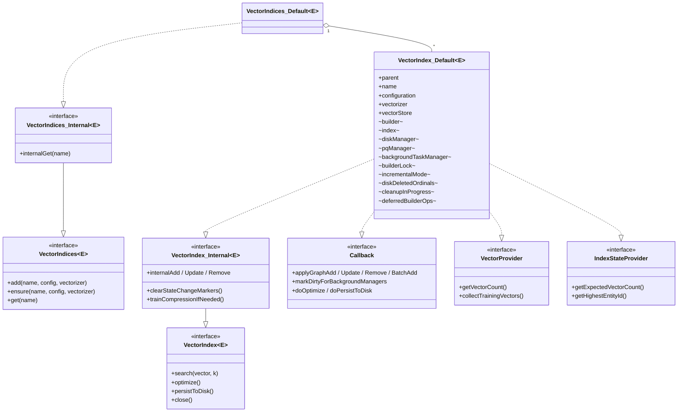
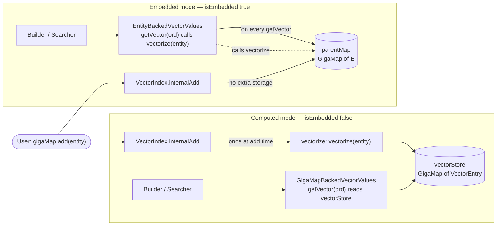
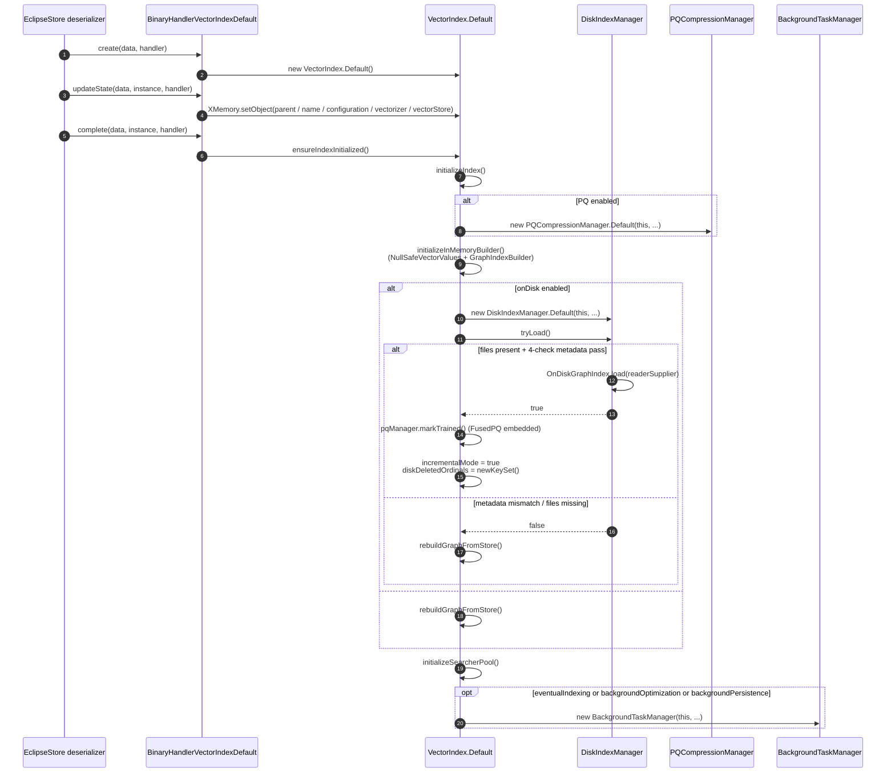
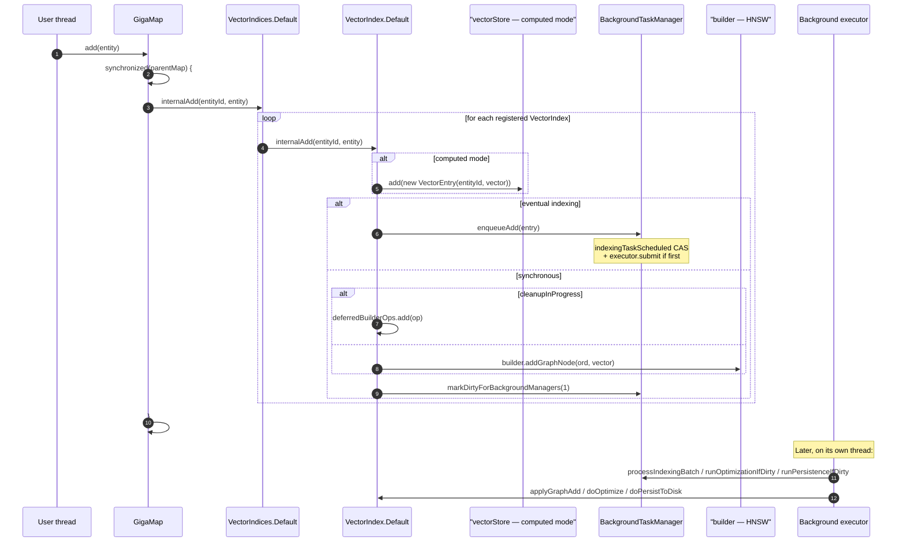
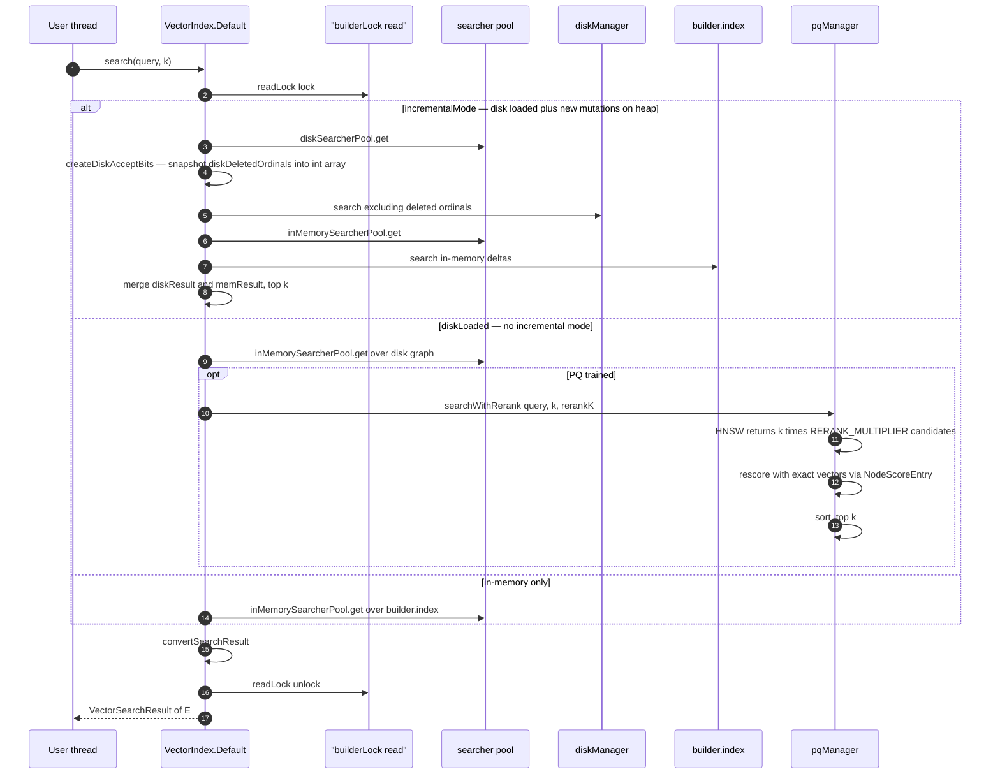
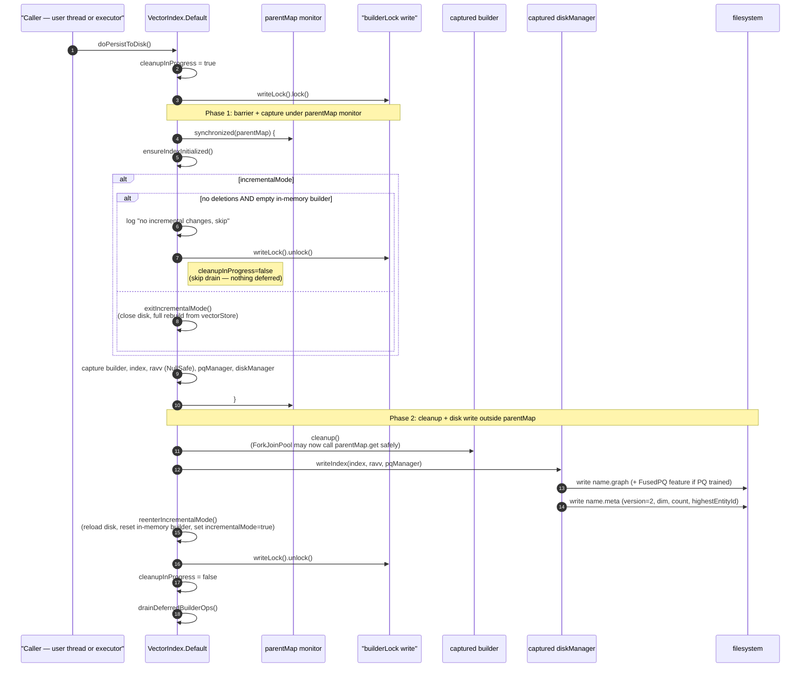
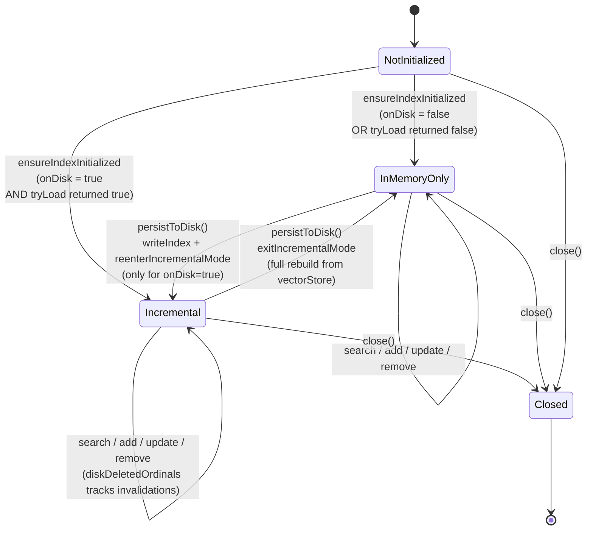
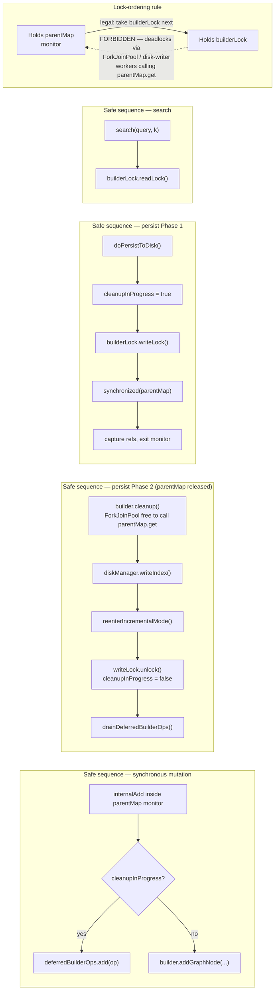
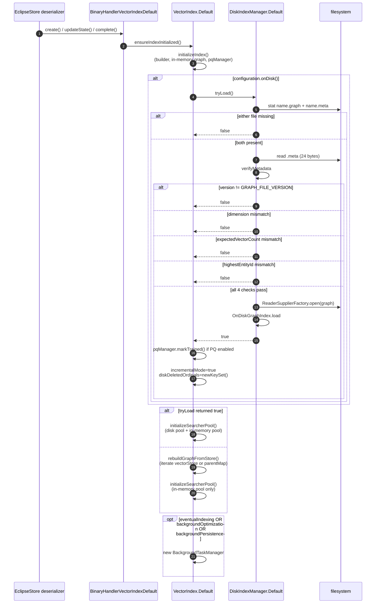

# GigaMap JVector — Architecture

This document describes the **internals** of the `gigamap-jvector` module. Audience: maintainers and reviewers of this code. For end-user configuration, factory presets, and quick-start examples, see [`README.md`](README.md). For asciidoc end-user docs, see [`docs/modules/gigamap/pages/indexing/jvector/`](../../docs/modules/gigamap/pages/indexing/jvector).

---

## 1. Overview

`gigamap-jvector` integrates [JVector](https://github.com/datastax/jvector) — a Java HNSW (Hierarchical Navigable Small World) k-NN library — with EclipseStore's `GigaMap` so that vector similarity search composes with GigaMap's indexed, lazily-loaded, persistable entity storage. The module turns a regular `GigaMap<E>` into a vector-searchable map: each entity gets one or more vector embeddings (named indices), GigaMap mutations broadcast to those indices automatically, and similarity queries return entities lazily.

### Module boundaries

- **Depends on**: `org.eclipse.store.gigamap` (transitively, the EclipseStore serializer + persistence stack), and `io.github.jbellis:jvector` (`4.0.0-rc.8`, see [`pom.xml`](pom.xml)).
- **Depended on by**: nothing in the EclipseStore tree. Consumers use it directly.
- **Java module name**: `org.eclipes.store.gigamap.jvector` (sic — typo preserved for compatibility; see [`module-info.java`](src/main/java/module-info.java)).
- **Public package**: `org.eclipse.store.gigamap.jvector`. The module exports this package and opens it to `org.eclipse.serializer.persistence` so the persistence layer can discover binary handlers via reflection.
- **Native dependency**: SIMD acceleration via `jdk.incubator.vector` (Panama) on Java 20+. Surefire `argLine` adds `--add-modules jdk.incubator.vector` plus the EclipseStore unsafe-access opens.

### When NOT to use this module

- **More than ~2.1 billion vectors per index.** JVector uses `int` for graph node ordinals; ordinals are GigaMap entity IDs, so the 32-bit ceiling is hard. Shard across multiple indices for larger datasets.
- **Vectors that may be `null`.** The `Vectorizer.vectorize()` contract forbids `null` returns. Missing/deleted ordinals are handled internally by `NullSafeVectorValues`, but a `Vectorizer` returning `null` for a present entity throws `IllegalStateException`.
- **PQ compression with `maxDegree != 32`.** The `FusedPQ` feature in JVector requires `maxDegree=32`; the configuration builder enforces this automatically when PQ is enabled.

---

## 2. Component map

### Diagram 1 — High-level component map



### Class inventory

| Class | Persisted? | Thread-safety | Role |
|---|---|---|---|
| `VectorIndices` (+ `Default`) | yes (handler) | per-method `synchronized(parentMap)` | Named registry of `VectorIndex` instances, fans GigaMap mutations out to all registered indices. |
| `VectorIndex` (+ `Default`) | yes (handler) | mixed: `parentMap` monitor + `builderLock` RW + volatiles | Per-index orchestrator. Implements four collaborator interfaces; owns builder, vectorStore, and the three optimization managers. |
| `VectorEntry` | yes (default GigaMap handler) | immutable | Tuple `(sourceEntityId, float[])` stored in `vectorStore` in computed mode. Indexed by `BinaryIndexerLong` on `sourceEntityId`. |
| `VectorIndexConfiguration` (+ `Builder`, `Default`) | yes (default handler) | immutable | Validated configuration object + factory presets. |
| `Vectorizer<E>` | yes (user-supplied subclass) | must be thread-safe (see §4) | User contract: entity → `float[]`. Single + batch methods. `isEmbedded()` selects storage strategy. |
| `VectorSimilarityFunction` | yes (enum) | immutable | `COSINE`, `DOT_PRODUCT`, `EUCLIDEAN`. Mapped 1:1 to JVector's enum. |
| `VectorSearchResult` (+ `Default`) | no | search-scoped | Lazy-entity-resolving `ScoredSearchResult<E>` wrapper. |
| `GigaMapBackedVectorValues` (+ `Caching`) | no | thread-safe via underlying GigaMap | Computed-mode `RandomAccessVectorValues`: ordinal → `vectorStore.get(id)`. |
| `EntityBackedVectorValues` (+ `Caching`) | no | thread-safe via underlying GigaMap | Embedded-mode `RandomAccessVectorValues`: ordinal → `parentMap.get(id)` → `vectorizer.vectorize(entity)`. |
| `ListRandomAccessVectorValues` | no | single-threaded use | Training-only adapter over `List<VectorFloat<?>>`. |
| `NullSafeVectorValues` | no | thread-safe (idempotent placeholder init) | Wrapper that returns a `1e-6f`-filled placeholder vector for null ordinals. |
| `BackgroundTaskManager` (+ `IndexingOperation` family, `Callback`) | no | lock-free queue + single daemon executor | Queue-driven indexing, scheduled optimization, scheduled persistence. |
| `PQCompressionManager` (+ `Default`, `VectorProvider`) | no | callable from executor thread; not re-entrant during training | Trains PQ codebook once; reranks search candidates with exact vectors. |
| `DiskIndexManager` (+ `Default`, `IndexStateProvider`) | no | not thread-safe; protected by `builderLock.writeLock()` | Loads/writes `*.graph` + `*.meta` files via JVector's `OnDiskGraphIndex` and `ReaderSupplier`. |
| `BinaryHandlerVectorIndexDefault` | — | stateless | EclipseStore binary handler for `VectorIndex.Default`. 40-byte payload, 5 references. |
| `BinaryHandlerVectorIndicesDefault` | — | stateless | EclipseStore binary handler for `VectorIndices.Default`. 16-byte payload, 2 references; eager-stores the `vectorIndices` table. |

---

## 3. Public API surface

### Diagram 2 — Class relationships



### Layering rationale

The `*.Internal` interfaces split the surface into "user-visible" vs. "GigaMap-callable" methods. End-user code sees only `VectorIndex<E>` and `VectorIndices<E>`; the GigaMap fan-out path uses the `*.Internal` views and never touches public methods. This keeps mutation-broadcast methods out of IDE autocomplete for end users and guarantees that GigaMap is the single writer of the indices' mutation pipeline.

`VectorIndex.Default` implements three additional collaborator interfaces (`Callback`, `VectorProvider`, `IndexStateProvider`). Each is the inversion-of-control hook for one of the optimization subsystems. The subsystems hold a typed reference to the interface, not back to `VectorIndex.Default`, so the orchestrator owns the dependency direction.

### Search result layering

`VectorSearchResult<E>` extends `ScoredSearchResult<E>` (from the parent `gigamap` module). The default impl wraps an `XGettingList<Entry<E>>`. Each `Entry` carries `entityId` (the HNSW ordinal — they are the same value), `score`, and a lazy `entity()` accessor that calls `parentMap.get(entityId)` on demand. This avoids materializing entities the caller never reads.

---

## 4. Vector data abstraction layer

JVector's HNSW algorithm consumes vectors through `io.github.jbellis.jvector.graph.RandomAccessVectorValues`. This module ships four implementations of that interface plus one wrapper. The split is driven by two orthogonal dimensions: **storage strategy** (computed vs embedded) and **role** (graph build/search vs PQ training vs deletion-safe wrapping).

### Diagram 3 — Storage strategies



### Mode trade-offs

| Aspect | Computed (`GigaMapBackedVectorValues`) | Embedded (`EntityBackedVectorValues`) |
|---|---|---|
| Vector storage | Separate `GigaMap<VectorEntry>` (the `vectorStore`) | None — read from entity directly |
| When `vectorize()` runs | Once on `add(entity)` | On every graph build/search access |
| Memory overhead | One `VectorEntry` per entity in `vectorStore` | None |
| ForkJoinPool deadlock risk in `cleanup()` | None (cleanup hits `vectorStore`, not `parentMap`) | **Yes** — workers call `parentMap.get()`. Mitigated by §11 lock-ordering rules and by skipping `removeDeletedNodes()` on update (§7.3). |
| Right choice when | Vectors come from external/expensive sources (embedding APIs) | Vector already in entity (`record(text, float[] embedding)`) |

### NullSafeVectorValues

The graph-traversal hot path computes similarity for every visited node, including the entry point. If a node has been deleted (or never had a vector), the underlying `getVector()` returns `null`, and JVector's similarity SIMD code crashes with `NullPointerException`. A zero vector is also unsafe — its squared magnitude underflows to zero in cosine, producing `Infinity`/`NaN` and triggering an `AssertionError`.

`NullSafeVectorValues` (see [`NullSafeVectorValues.java:48`](src/main/java/org/eclipse/store/gigamap/jvector/NullSafeVectorValues.java)) returns a placeholder vector filled with `1e-6f` per component when the delegate returns `null`. The constant is large enough for SIMD-stable arithmetic but small enough that the placeholder always scores near-zero similarity. Actual exclusion of deleted nodes happens at a higher level via JVector's `liveNodes` bitmask; the placeholder is just a defensive substitute that prevents arithmetic faults during traversal.

The placeholder is lazily constructed once per wrapper instance and cached. Lazy initialization is *not* synchronized — if two threads race, both produce the same value and the last write wins; the field is referenced as a `VectorFloat<?>` so the publication is benign.

### `.Caching` variants

Both `GigaMapBackedVectorValues` and `EntityBackedVectorValues` have an inner `.Caching` subclass that overlays a `ConcurrentHashMap<Integer, VectorFloat<?>>` over `getVector()`. The cache is **search-scoped, unbounded, and never evicted**: a fresh `.Caching` instance is created at the start of every search via `createCachingVectorValues()` and discarded when the search ends. Each `copy()` produces an independent cache, so per-thread `GraphSearcher` clones do not contend.

The cache is essential for embedded mode (re-vectorizing the same entity many times during a single traversal would dominate latency) and meaningful for computed mode (avoids repeated `GigaMap.get()` + `VectorFloat<?>` allocation).

### `Vectorizer<E>` invocation contract

- Called from: HNSW build thread, query threads, ForkJoinPool cleanup workers (embedded mode only).
- **Must be thread-safe**: multiple threads may call `vectorize()` concurrently on the same instance. Recent fix `bb18020d` clarified this contract.
- **Must not return `null`** — see §1 limits.
- `vectorizeAll(List<E>)` defaults to per-element calls; override for batch APIs (commit `e7c306e5` introduced this).
- `isEmbedded()` is consulted at index construction and at every `createVectorValues()` call; it must be stable for the lifetime of the index.

### `ListRandomAccessVectorValues`

Used only by `PQCompressionManager` to wrap a sampled `List<VectorFloat<?>>` for codebook training (see §9). After training it is discarded.

---

## 5. Persistence layer (EclipseStore binary handlers)

EclipseStore persists `VectorIndices.Default` and `VectorIndex.Default` via two custom handlers. Both extend `AbstractBinaryHandlerStateChangeFlagged`, which integrates with GigaMap's incremental-store pipeline (only changed indices are restored to the persistence working set).

### `BinaryHandlerVectorIndicesDefault`

Layout: 16 bytes, two object-id references.

| Offset | Field | Notes |
|---|---|---|
| 0 | `parent` (`GigaMap.Internal<?>`) | Back-reference. Resolved lazily. |
| 8 | `vectorIndices` (`EqHashTable<String, VectorIndex.Internal<?>>`) | The named-index table. **Eager-stored** via `data.storeReferenceEager(...)` so that adding a new index forces all other indices in the table to be considered for storage. |

Empty-instance creation: `new VectorIndices.Default<>(null, null, false)`. Fields are then patched in via `XMemory.setObject` against pre-resolved field offsets.

### `BinaryHandlerVectorIndexDefault`

Layout: 40 bytes, five object-id references.

| Offset | Field | Notes |
|---|---|---|
| 0 | `parent` (`VectorIndices`) | Back-reference. |
| 8 | `name` (`String`) | Used as the on-disk file prefix. |
| 16 | `configuration` (`VectorIndexConfiguration`) | Immutable; safely shared. |
| 24 | `vectorizer` (`Vectorizer`) | User class; must be persistable by EclipseStore. |
| 32 | `vectorStore` (`GigaMap<VectorEntry>`) | `null` if `vectorizer.isEmbedded()`. |

Empty-instance creation: `new VectorIndex.Default<>()`. After `updateState` patches the five persistent fields, **`complete()` calls `instance.ensureIndexInitialized()`** — this is the seam where all transient state (builder, in-memory graph, disk manager, PQ manager, background task manager, searcher pools) is rebuilt or re-loaded.

### Persistent vs transient fields of `VectorIndex.Default`

| Field | Persistent | Notes |
|---|---|---|
| `parent`, `name`, `configuration`, `vectorizer`, `vectorStore` | **yes** | The only fields persisted. |
| `vectorTypeSupport` | no | Looked up from JVector. |
| `builder`, `index` | no | In-memory HNSW graph. Rebuilt from `vectorStore` (or fully empty in incremental mode). |
| `diskManager` | no | Recreated; loads from disk if files exist. |
| `pqManager` | no | Recreated; treated as trained if FusedPQ is embedded in `.graph`. |
| `backgroundTaskManager` | no | Recreated only if eventual indexing or any background feature is enabled. |
| `builderLock` | no | Fresh `ReentrantReadWriteLock`. |
| `incrementalMode`, `diskDeletedOrdinals`, `cleanupInProgress`, `deferredBuilderOps` | no | All concurrency-control state. Reset on every load. |
| `inMemorySearcherPool`, `diskSearcherPool` | no | `ExplicitThreadLocal<GraphSearcher>` pools. |

### `storeChangedChildren`

Both handlers' parents (`AbstractBinaryHandlerStateChangeFlagged`) call `storeChangedChildren(Storer)` during incremental store. `VectorIndex.Default.storeChangedChildren` stores `vectorStore` only when **not** embedded — otherwise no extra child store is needed since vectors live inside the parent GigaMap's entities.

---

## 6. `VectorIndex.Default` — the orchestrator

`VectorIndex.Default<E>` extends `AbstractStateChangeFlagged` and implements four interfaces:

- `VectorIndex.Internal<E>` — public + GigaMap-internal API
- `BackgroundTaskManager.Callback` — the seam where background ops apply graph mutations and trigger optimize/persist
- `PQCompressionManager.VectorProvider` — supplies vectors for codebook training
- `DiskIndexManager.IndexStateProvider` — supplies metadata (`expectedVectorCount`, `highestEntityId`) for on-disk format verification

### Diagram 4 — Initialization sequence



`ensureIndexInitialized()` is idempotent and guarded — it skips work when `builder != null` or when the disk graph is already loaded. It is called both from the binary handler `complete()` and from every method that needs the in-memory builder available.

The disk-load branch flips `incrementalMode = true` only after `diskDeletedOrdinals` is initialized (safe-publication ordering). Search and mutation paths read `incrementalMode` as a `volatile` and rely on this ordering to never see a `null` `diskDeletedOrdinals`.

---

## 7. Operation flows

### 7.1 Add entity

### Diagram 5 — `add()` flow



The synchronous mutation path **never acquires `builderLock`**: a builder write inside the GigaMap monitor would deadlock with ForkJoinPool workers (in `cleanup()`/`removeDeletedNodes()`) that reach back into `parentMap`. Instead, it checks the `cleanupInProgress` volatile and, if true, parks the op in `deferredBuilderOps` (a `ConcurrentLinkedQueue<Runnable>`). After `cleanup()` releases the write lock, `drainDeferredBuilderOps()` runs every queued op in order.

### 7.2 Search query

### Diagram 6 — `search()` flow



`createDiskAcceptBits()` snapshots `diskDeletedOrdinals` (a `ConcurrentHashMap.newKeySet()`) into a primitive `int[]` in a single pass, then materializes the JVector accept-bits mask from that snapshot. This is the hot-path anti-boxing fix from commit `883b9c74` — reading `Set<Integer>` directly per-iteration would auto-unbox on every probe.

`convertSearchResult()` maps each `SearchResult.NodeScore[node, score]` to a `VectorSearchResult.Entry` whose `entityId == node` (HNSW ordinal) and whose `entity()` accessor lazily calls `parentMap.get(entityId)`.

### 7.3 Update entity

`internalUpdate(entityId, oldEntity, newEntity)`:

- Computed mode: `vectorStore.set(entityId, new VectorEntry(...))`, then either enqueue `IndexingOperation.Update` or run inline.
- Embedded mode: **the inline path skips `removeDeletedNodes()`**. JVector's `removeDeletedNodes()` runs on a ForkJoinPool that calls `parentMap.get()` for every node it inspects — and we hold the `parentMap` monitor during a synchronous mutation. Skipping the rebuild is safe because the next `optimize()` or `persistToDisk()` will rebuild via `cleanup()` outside the monitor (see §7.6 Phase 2). Until then, searches see the new vector via `EntityBackedVectorValues` (which always reads the latest entity), but the graph edges still reflect the old vector. Recall is briefly degraded; correctness is preserved.

In incremental mode, the affected ordinal is also added to `diskDeletedOrdinals` so the disk-side search ignores it.

### 7.4 Remove entity

Symmetric to update: `vectorStore.removeById(entityId)` (computed mode), enqueue `Remove` or run `builder.markNodeDeleted(ordinal)` inline, and add to `diskDeletedOrdinals` in incremental mode. Note that `markNodeDeleted` only sets a tombstone bit; the ordinal stays in the graph until the next `cleanup()`.

### 7.5 Optimize

`optimize()` drains the indexing queue (if eventual indexing), then `doOptimize()`:

1. `cleanupInProgress = true` (volatile signal to defer concurrent sync mutations).
2. `synchronized(parentMap)` → `ensureIndexInitialized()` → capture `builder` reference → exit synchronized.
3. `builderLock.writeLock().lock()` — exclusive.
4. `builder.cleanup()` — runs on ForkJoinPool. Now safe to call `parentMap.get()` from workers because the parent monitor is released.
5. `builderLock.writeLock().unlock()`.
6. `cleanupInProgress = false`.
7. `drainDeferredBuilderOps()` — replay any sync mutations that arrived during cleanup.
8. `markStateChangeChildren()` — mark for next persist.

### 7.6 PersistToDisk

The most intricate flow. `persistToDisk()` is a no-op for in-memory indices; on disk, it drains the queue and calls `doPersistToDisk()`.

### Diagram 7 — `doPersistToDisk()` two-phase protocol



Two key observations:

- **Phase 1 holds `parentMap`; Phase 2 does not.** The synchronized block is a barrier that lets in-flight GigaMap mutations finish, captures all the references the disk writer will need, and (if applicable) tears down incremental mode. As soon as the references are captured, the monitor is released — `cleanup()` and `writeIndex()` are free to invoke ForkJoinPool/disk-writer threads that themselves call `parentMap.get()` (e.g., for embedded vectorizers). `builderLock.writeLock()` stays held throughout, so concurrent searches and background applies still block.
- **Skip-on-clean shortcut**. `isIncrementalClean()` short-circuits when there are no `diskDeletedOrdinals` and the in-memory builder graph has zero nodes. Without this, every persist would tear down and rebuild the (unchanged) disk graph.

`exitIncrementalMode()` closes the on-disk graph, clears `diskDeletedOrdinals`, closes the in-memory builder, and rebuilds a fresh full-graph builder from `vectorStore` (or by iterating `parentMap` for embedded mode). `reenterIncrementalMode()` reloads the just-written disk graph, initializes a fresh empty in-memory builder, sets `diskDeletedOrdinals = newKeySet()`, and finally flips `incrementalMode = true` (safe-publication ordering — state fields are written *before* the volatile flag).

### 7.7 Close / shutdown

`close()` calls `shutdownBackgroundTaskManager(drainPending=true, optimizeOnShutdown, persistOnShutdown)`. There is one important fall-through path:

> **Commit `fa189228`**: if no background features are enabled, `backgroundTaskManager` is `null`. The pre-fix behavior was to skip persist entirely on close, silently dropping in-memory changes. The fix: when `backgroundTaskManager == null && persistOnShutdown && configuration.onDisk()`, call `doPersistToDisk()` directly so the pending changes are flushed before the index closes.

After background shutdown, `close()` acquires `builderLock.writeLock()` and tears down: searcher pools, builder, in-memory index, disk manager, PQ manager.

---

## 8. Background task subsystem

`BackgroundTaskManager` consolidates three workloads onto a single daemon thread named `VectorIndex-Background-{name}`:

1. Draining the indexing queue
2. Scheduled optimization (`runOptimizationIfDirty`)
3. Scheduled persistence (`runPersistenceIfDirty`)

The three never run concurrently because they all execute on the same `ScheduledExecutorService`, and they all eventually contend for `builderLock.writeLock()` anyway — a single thread is therefore sufficient.

### `IndexingOperation` sealed family

Defined in [`BackgroundTaskManager.java:53`](src/main/java/org/eclipse/store/gigamap/jvector/BackgroundTaskManager.java):

- `Add(VectorEntry entry)` → `callback.applyGraphAdd(entry)` + dirty-mark 1
- `Update(VectorEntry entry)` → `callback.applyGraphUpdate(entry)` + dirty-mark 1
- `Remove(int ordinal)` → `callback.applyGraphRemove(ordinal)` + dirty-mark 1
- `BatchAdd(List<VectorEntry> entries)` → single `applyGraphBatchAdd` call + dirty-mark `entries.size()` (acquires `builderLock` once for the entire batch — see commit `e7c306e5`)

### Enqueue protocol

`enqueue(op)`:

1. `indexingQueue.add(op)` — non-blocking `ConcurrentLinkedQueue`.
2. `indexingTaskScheduled.compareAndSet(false, true)` — at-most-one-active-task latch.
3. On CAS success: `executor.submit(this::processIndexingBatch)`.

`processIndexingBatch` polls the queue dry, then in `finally` resets `indexingTaskScheduled = false` and re-checks the queue (a producer who arrived between the last poll and the flag reset would otherwise be stranded).

### Drain triggers

| Trigger | Caller | Behavior |
|---|---|---|
| `enqueue` itself | producer | submits one batch task if not already scheduled |
| `drainQueue()` | user thread before `optimize()`/`persistToDisk()` | submits and **`Future.get()`**-blocks |
| inline before `doOptimize` / `doPersistToDisk` | executor thread | direct `processAllPendingIndexingOps()` call (no submit, same thread) |
| `discardQueue()` | `internalRemoveAll()` | clears queue + resets latch (pending ops would refer to stale ordinals) |
| `finalShutdownWork(drainPending=true, ...)` | `shutdown()` | one-shot drain on executor before `executor.shutdown()` |

### Debouncing

`optimizationChangeCount` and `persistenceChangeCount` (both `AtomicInteger`) accumulate across mutations. The scheduled tasks return early when `current < threshold`, so a long quiet period costs only the periodic timer fire. Both counters reset to zero only after a successful run.

### "Eventual indexing" semantics

`eventualIndexing=true` decouples vector-store updates (synchronous, durable) from graph mutations (queued). Search may miss recently-added vectors until the queue drains, but `optimize()`, `persistToDisk()`, and `close()` always drain first. The setting is logged at construction and is otherwise just a flag the orchestrator consults to choose between inline mutation and `enqueue*()`.

### Failure handling

`processAllPendingIndexingOps` wraps each `op.execute()` in a `try { } catch(Exception)` that logs and continues. Likewise `runOptimizationIfDirty`/`runPersistenceIfDirty` log and swallow. **This is intentional**: re-throwing would kill the executor and orphan the rest of the queue, which is worse than dropping a single bad op. The trade-off is that a buggy `Vectorizer` could silently desync the graph from the source — covered by integration tests and documented in §13.

---

## 9. PQ compression subsystem

Product Quantization (PQ) trades exact distances for memory: each subspace of the vector is quantized to one of 256 centroids, so a 768-dim float vector (3 KB) collapses to ~192 bytes. The HNSW graph then operates on these compressed codes for fast candidate selection, and a final reranking pass uses exact vectors.

### Training

`PQCompressionManager.Default.trainIfNeeded()`:

- Idempotent — if `pqTrained == true`, return.
- Requires ≥ 256 vectors. Below that, log a warning and skip (the index proceeds without compression).
- `trainPQ()`: `provider.collectTrainingVectors()` → `ListRandomAccessVectorValues` → `ProductQuantization.compute(ravv, subspaces, 256, centerForLowDim)`. The `centerForLowDim` flag is `dimension < 64`. After `compute`, `pq.encodeAll(ravv)` produces the `CompressedVectors`; the manager flips `pqTrained = true`.

Training is **one-shot**. The graph never retrains automatically — calling `reset()` is the only way to re-train. Once on-disk indices embed a `FusedPQ` feature in `.graph`, the PQ is implicitly considered trained on reload (`pqManager.markTrained()` in `reenterIncrementalMode` / load path).

### Subspaces

Default: `max(1, dimension / 4)`. Configurable via `pqSubspaces`; the configuration validator requires `dimension % pqSubspaces == 0`.

### `VectorProvider` indirection

`collectTrainingVectors()` is implemented by `VectorIndex.Default` and switches on `isEmbedded()`:

- Computed mode: iterate `vectorStore`, materialize `VectorFloat<?>` from each `VectorEntry`.
- Embedded mode: iterate `parentMap`, call `vectorizer.vectorize(entity)`.

This keeps `PQCompressionManager` agnostic of GigaMap details.

### Reranking

`searchWithRerank(query, k, rerankK, searcher, ravv, similarity)`:

1. Ask HNSW for `max(k * PQ_RERANK_MULTIPLIER, rerankK)` approximate candidates.
2. For each candidate, fetch the **exact** vector from `ravv` (always wrapped by `NullSafeVectorValues`) and compute exact similarity → `NodeScoreEntry(node, score)`.
3. Sort `NodeScoreEntry` array by score descending, truncate to top-k.
4. Return as `SearchResult.NodeScore[]`.

The `PQ_RERANK_MULTIPLIER` constant controls the fan-out: larger means better recall but more exact-similarity work.

### `FusedPQ` feature on disk

When PQ is trained at persist time, `DiskIndexManager.writeIndexWithFusedPQ` embeds two features into the `.graph` file:

- `InlineVectors` — full-precision vectors stored inline, used for exact reranking on disk loads.
- `FusedPQ` — the codebook + per-node compressed code, used for fast candidate scoring.

`FusedPQ` requires `maxDegree=32`. The configuration builder enforces this by silently overriding when PQ is enabled.

### Failure mode

If `trainIfNeeded()` throws (training data degenerate, dimension mismatch, etc.), the exception is logged and `pqTrained` stays `false`. The next `writeIndex()` then falls back to the simple non-compressed path: `OnDiskGraphIndex.write(index, ravv, graphPath)`.

---

## 10. On-disk index subsystem

### File layout

Two files per index, named after `VectorIndex.Default.name`:

- `{name}.graph` — JVector's `OnDiskGraphIndex` payload. Contains the HNSW edges plus optional features (`InlineVectors`, `FusedPQ`). Sized in megabytes for millions of vectors.
- `{name}.meta` — 24-byte sidecar:
  - `int` format version (currently `2`, see [`DiskIndexManager.java:66`](src/main/java/org/eclipse/store/gigamap/jvector/DiskIndexManager.java))
  - `int` dimension
  - `long` `expectedVectorCount`
  - `long` `highestEntityId` (added in v2)

### Format version history

| Version | Fields | Notes |
|---|---|---|
| 1 | version, dim, count | Vulnerable to balanced add/remove corruption (see below). |
| 2 | + `highestEntityId` | Commit `3b7b01bc`. GigaMap allocates entity ids monotonically, so this catches add/remove pairs that leave the count unchanged. |

Bumping the version invalidates existing files; they are silently rebuilt from `vectorStore` (or the parent map for embedded mode) on first load — no data loss, one-time cold-start cost.

### Write path

`DiskIndexManager.writeIndex(index, ravv, pqManager)`:

1. `Files.createDirectories(indexDirectory)`.
2. If `pqManager != null && pqManager.isTrained() && pqManager.getPQ() != null` → `writeIndexWithFusedPQ` (parallel or sequential depending on `parallelOnDiskWrite`).
3. Otherwise → `OnDiskGraphIndex.write(index, ravv, graphPath)` (simple, no compression).
4. `writeMetadata(metaPath)` — pulls `expectedVectorCount` and `highestEntityId` from the `IndexStateProvider` callback (= `VectorIndex.Default`).

### Load path

`DiskIndexManager.tryLoad()`:

1. Return `false` if `indexDirectory == null` or files missing.
2. `verifyMetadata(metaPath)`: read all four fields and compare to current state. Any mismatch → return `false` (caller then rebuilds from source).
3. `readerSupplier = ReaderSupplierFactory.open(graphPath)` — memory-mapped.
4. `diskIndex = OnDiskGraphIndex.load(readerSupplier)`.
5. `loaded = true`; log `"Loaded disk index '{name}' with {n} nodes"`.

Any thrown exception is caught, `close()` is called to release resources, and `tryLoad` returns `false`.

### Count-collision corruption (commit `3b7b01bc`)

The motivating scenario:

> Persist 50 vectors; the meta file records `count=50, highestEntityId=50`. After persist, remove vector #42 and add a replacement. GigaMap now has count=50 and `highestEntityId=51`. **Without** v2, restart-from-disk would see `count=50` matching and load the stale graph — search would hit a phantom `#42` and miss the new entity entirely.

V2 catches this at load time via the entity-id check and triggers a rebuild. Cost is 8 bytes on disk and one `long` comparison. Test: `VectorIndexDiskTest.testRecoveryRejectsCountCollision`.

### Incremental on-disk mode

After a successful `tryLoad()`, the index enters **incremental on-disk mode**. The disk graph serves searches; all new mutations go to a fresh in-memory builder; `diskDeletedOrdinals` tracks ordinals removed/updated since load. Searches merge results from both layers (§7.2). The next `persistToDisk()` exits incremental mode (full rebuild from `vectorStore` into a single in-memory graph), writes that graph to disk, and re-enters incremental mode.

### Diagram 8 — Incremental on-disk state machine



Subtlety: `persistToDisk()` short-circuits via `isIncrementalClean()` when there are no `diskDeletedOrdinals` and the in-memory builder is empty — the on-disk state then stays in `Incremental` rather than transiting through `InMemoryOnly`.

---

## 11. Concurrency model

### Lock inventory

| Mechanism | Type | Held by | Protects |
|---|---|---|---|
| `parentMap` monitor | intrinsic `synchronized` | GigaMap mutations; `optimize`/`persist` Phase 1; `trainCompressionIfNeeded` | Serialization of GigaMap mutations and barrier for index orchestration. |
| `builderLock` | `ReentrantReadWriteLock` | Read = search + background-applied mutations; Write = optimize, persist, removeAll, close | Exclusive access to the in-memory `GraphIndexBuilder`. |
| `cleanupInProgress` | `volatile boolean` | Set by `optimize`/`persist`; read by sync-mutation paths | Defer-trigger: tells synchronous mutations to enqueue into `deferredBuilderOps` instead of touching the builder. **Not a lock.** |
| `incrementalMode` | `volatile boolean` | Written under `builderLock.writeLock()`; read everywhere | Search-path mode flag. Always written **after** `diskDeletedOrdinals` is initialized (safe publication). |
| `diskDeletedOrdinals` | `ConcurrentHashMap.newKeySet()` | Mutations + `createDiskAcceptBits` snapshot | Set of ordinals invalidated post-disk-load. |
| `deferredBuilderOps` | `ConcurrentLinkedQueue<Runnable>` | Sync mutations during cleanup; drained after | Holds builder ops that arrived while `cleanupInProgress`. |

### Lock-ordering rule

> **Acquire `parentMap` before `builderLock`. Never the reverse.**

Reverse acquisition would deadlock: `cleanup()` and `writeIndex()` run on ForkJoinPool/disk-writer threads, and those workers call `parentMap.get()` (for embedded vectorizers, and for vectorStore lookups in computed mode). If a thread held `builderLock.writeLock()` and tried to enter `synchronized(parentMap)`, it would wait for any in-flight mutation; but that mutation, holding `parentMap`, may need a worker thread to complete its own builder work — which is impossible if all workers are blocked behind the write lock.

The persist/optimize protocol explicitly works around this:

```
parentMap.synchronized {
    capture references            // brief
}
// monitor released
builderLock.writeLock {           // still exclusive against searches/applies
    cleanup()                     // ForkJoinPool free to call parentMap.get()
    writeIndex()                  // disk writer free to call parentMap.get()
}
```

### `cleanupInProgress` / `deferredBuilderOps` protocol

Synchronous mutations (`internalAdd` etc.) hold the `parentMap` monitor and can't take `builderLock` (lock-ordering rule). Instead:

```java
if (cleanupInProgress) {
    deferredBuilderOps.add(() -> builder.addGraphNode(ord, vector));
} else {
    builder.addGraphNode(ord, vector);   // safe: cleanup not running
}
```

After `cleanup()`/`writeIndex()` complete and `cleanupInProgress` flips back to `false`, `drainDeferredBuilderOps()` runs every queued op. The volatile is a one-way handoff — readers see a clean before/after with no need for fences beyond what `volatile` already provides.

### Race fixes (commit `883b9c74`)

Two issues introduced by incremental on-disk mode (`89c3417b`):

1. **`diskDeletedOrdinals` mutated during `createDiskAcceptBits`** — sizing the boolean mask while the set grew underneath produced `ArrayIndexOutOfBoundsException`. Fix: snapshot into a primitive `int[]` in a single pass, then build the mask from the snapshot.
2. **`incrementalMode` visibility** — was a plain `boolean`. A thread could see `incrementalMode=true` while still seeing a `null` `diskDeletedOrdinals`. Fix: `volatile boolean`, with the discipline that all dependent state fields are written *before* the flag flip.

### Diagram 9 — Lock ordering



---

## 12. Restart-from-disk lifecycle

### Diagram 10 — Restart-from-disk



PQ "trained" is restored implicitly: the codebook lives inside the `FusedPQ` feature in the `.graph` file, so once the on-disk graph loads successfully, the PQ manager is marked trained without re-running training. If the disk load fails, the next `persistToDisk()` will re-train (assuming ≥ 256 vectors).

---

## 13. Failure modes and recovery

| Scenario | Behavior | Recovery |
|---|---|---|
| Background indexing op throws | `processAllPendingIndexingOps` logs `error`, drops the op, continues. | Graph desync until next manual `optimize()`/`persistToDisk()` rebuilds. Exposed by `VectorIndexConcurrentStressTest`. |
| PQ training throws | `trainPQ` logs and leaves `pqTrained=false`. | Next persist falls back to non-compressed `OnDiskGraphIndex.write()`. Will retry on the persist after that. |
| Disk write IOException mid-`writeIndex` | Wrapped as `IORuntimeException` and propagated out of `doPersistToDisk`. The `.graph` may be partially written and `.meta` may be missing. | On next load, `verifyMetadata` fails (missing or mismatched .meta) → rebuild from source. |
| Disk load IOException | Caught in `tryLoad`, logs warning, calls `close()`, returns `false`. | Caller (`initializeIndex`) falls through to `rebuildGraphFromStore`. |
| Count-collision corruption | v2 metadata mismatch on load. | Rebuild from source via `rebuildGraphFromStore`. |
| `persistOnShutdown=true` with no background features | Pre-`fa189228`: changes silently dropped. Post-fix: `close()` falls through to direct `doPersistToDisk()` call. | None needed — change is durable. |
| `Vectorizer` returns `null` | `IllegalStateException` at insertion. | Hard fail — fix the vectorizer. |
| `Vectorizer` not thread-safe | Sporadic incorrect vectors / NPEs in build worker threads. | Fix the vectorizer (see commit `bb18020d` for the contract clarification). |

---

## 14. Testing surface

| Test class | Scope |
|---|---|
| `VectorIndexConfigurationTest` | Builder validation: required fields, value ranges, FusedPQ `maxDegree=32` enforcement, factory presets. |
| `VectorIndicesTest` | Registry semantics: `add` / `ensure` / `get`, fan-out broadcast, iteration. |
| `VectorValuesTest` | `RandomAccessVectorValues` impls: getVector, copy, null handling. |
| `VectorIndexTest` | End-to-end smoke: register, add, search, optimize, close. |
| `VectorIndexSetAndSearchTest` | Mutation/search interleaving correctness (commit `c4506d20` regression test for stale view after `set`). |
| `VectorSearchSubQueryTest` | GigaMap sub-query integration (commit `2c28a497`). |
| `VectorIndexDiskTest` | On-disk persistence: load, mismatch detection, **`testRecoveryRejectsCountCollision`** (commit `3b7b01bc`), partial-write recovery. |
| `VectorIndexConcurrentStressTest` | Races between mutations, searches, optimize, and persist under load. |
| `VectorIndexInterleavingTest` | Specific orderings of operations against incremental on-disk mode (commit `883b9c74`). |
| `VectorIndexEventualIndexingTest` | Eventual-indexing queue lifecycle (commit `ecbb1bc5`). |
| `VectorIndexBatchTest` | `BatchAdd` operation (commit `e7c306e5`). |
| `VectorIndexBenchmarkTest`, `VectorIndexPerformanceTest` | Recall and QPS measurements (disabled by default). |

When adding regression tests, prefer the most-specific existing class. New incremental-mode invariants belong in `VectorIndexInterleavingTest`; new corruption-detection invariants belong in `VectorIndexDiskTest`.

---

## 15. Module dependencies and JVM requirements

[`module-info.java`](src/main/java/module-info.java):

```
requires transitive org.eclipse.store.gigamap;
requires            jvector;
exports             org.eclipse.store.gigamap.jvector;
opens               org.eclipse.store.gigamap.jvector to org.eclipse.serializer.persistence;
```

[`pom.xml`](pom.xml) properties:

- `jvector.version = 4.0.0-rc.8`

Surefire `argLine` (required for tests and recommended for production deployment):

```
--add-modules jdk.incubator.vector
--add-exports java.base/jdk.internal.misc=ALL-UNNAMED,org.eclipse.serializer.base
--add-opens   java.base/java.lang=ALL-UNNAMED,org.eclipse.serializer.base
--add-opens   java.base/java.nio=ALL-UNNAMED,org.eclipse.serializer.base
--add-opens   java.base/sun.nio.ch=ALL-UNNAMED,org.eclipse.serializer.base
--add-reads   org.eclipse.serializer.base=ALL-UNNAMED
```

The first flag enables Panama Vector for SIMD acceleration on Java 20+. The remaining flags are the standard EclipseStore unsafe-access opens.

---

## 16. References

- **End-user docs**: [`README.md`](README.md), [`docs/modules/gigamap/pages/indexing/jvector/`](../../docs/modules/gigamap/pages/indexing/jvector)
- **JVector upstream**: <https://github.com/datastax/jvector>
- **Recent commits whose invariants this document captures**:
  - `3b7b01bc` — v2 metadata + `highestEntityId` corruption detection
  - `fa189228` — `persistOnShutdown` fallback when no background features
  - `883b9c74` — incremental-mode race fixes
  - `89c3417b` — incremental on-disk mode introduction
  - `c4506d20` — refresh HNSW graph view after `set()`
  - `bb18020d` — vectorizer thread-safety contract
  - `e7c306e5` — batch vectorization + `BatchAdd` operation
