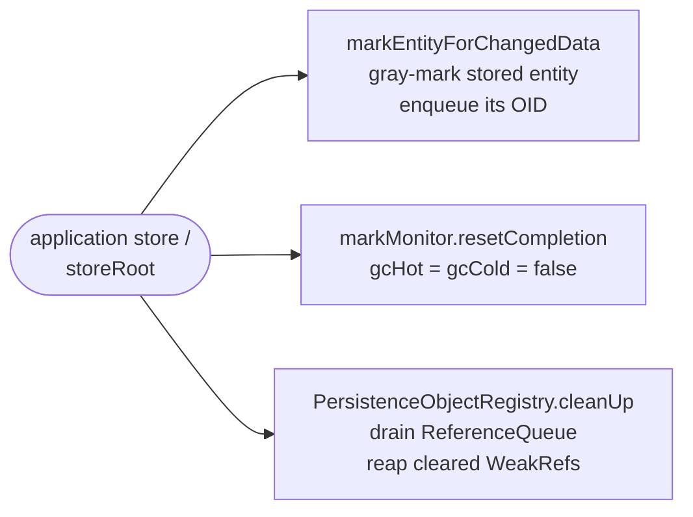
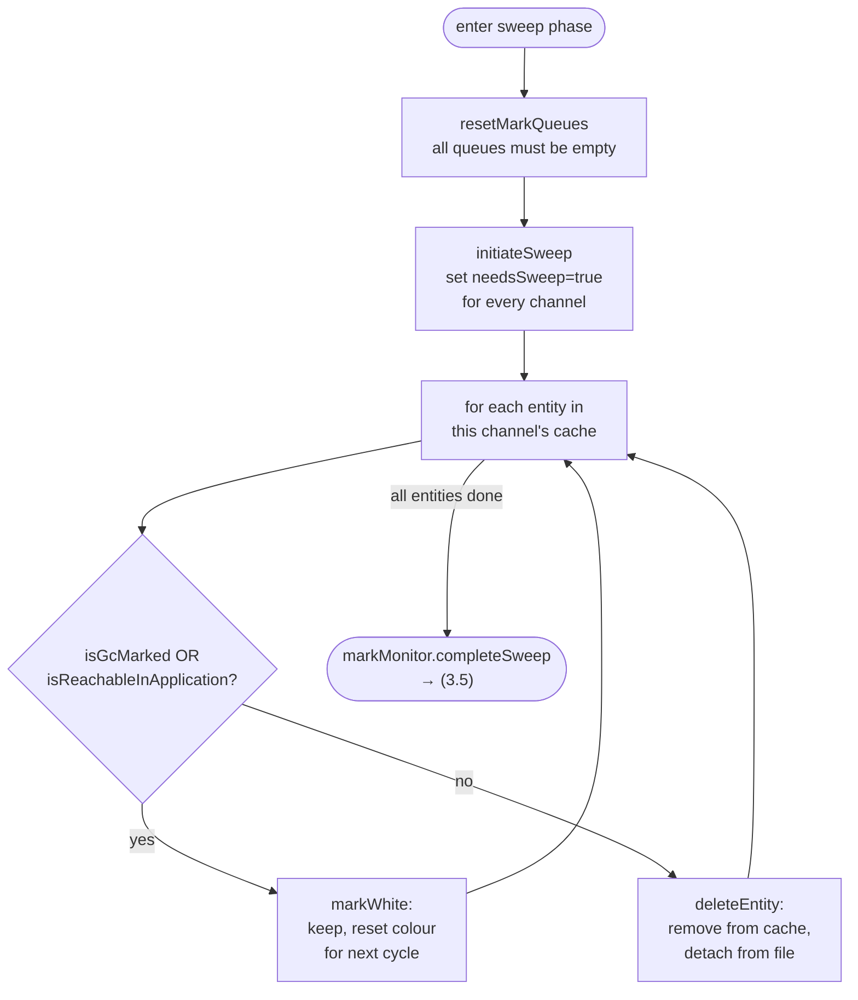
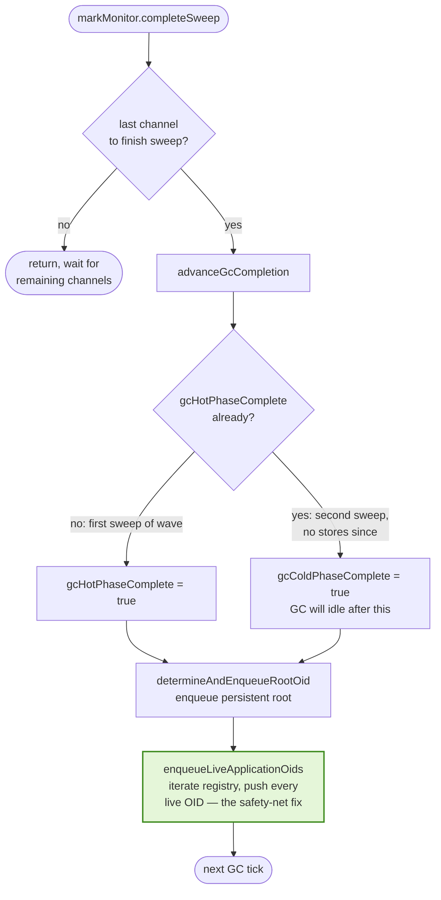
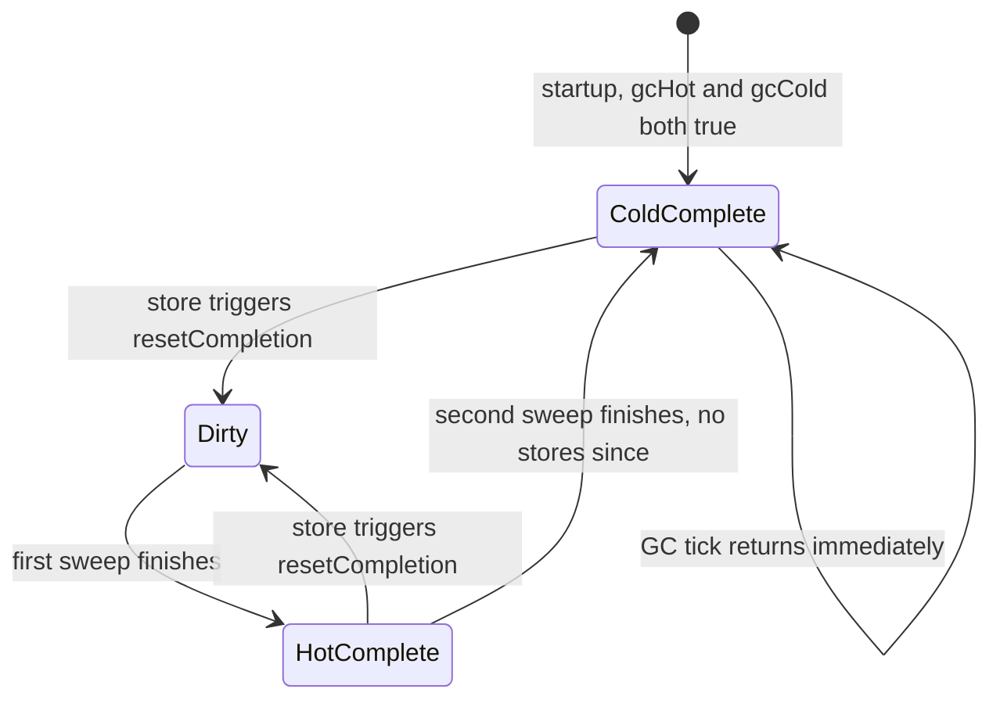

# Storage Garbage Collection

This document describes the EclipseStore storage garbage collector (storage GC), how it cooperates with the JVM's garbage collector, and the subtle interactions that underlie the *registry safety net* and the *zombie OID* failure mode.

---

## 1. Purpose

The storage GC reclaims on-disk space occupied by entities that are no longer reachable. Concretely it:

- Walks the persistent object graph starting from the persistent root.
- Marks every reached storage entity (a binary record in a storage channel file).
- Sweeps the entity cache, deleting entries whose binary records are not reachable.
- Triggers file-level compaction for the freed regions.

It is **not** the same thing as the JVM GC. Storage entities live in storage files (and in the per-channel in-memory `StorageEntityCache`); Java objects live on the JVM heap. A single logical datum can exist as *both* a storage entity (binary record + cache entry) and a live Java object — the two are correlated via an **object id** (OID).

Key classes:

| Concern | Class |
|---|---|
| Per-channel entity cache & mark/sweep driver | `StorageEntityCache.Default` |
| Cross-channel mark monitor, OID mark queue, completion state machine | `StorageEntityMarkMonitor.Default` |
| Per-channel mark queue (long[] buffer) | `StorageObjectIdMarkQueue` |
| Dangling-reference callback | `StorageGCZombieOidHandler` |
| Application-registry bridge (combined interface) | `LiveObjectIdsHandler` |
| — sweep filter half of the bridge | `ObjectIdsSelector` (serializer) |
| — mark-seed half of the bridge | `LiveObjectIdsIterator` |
| Embedded-mode implementation of the bridge | `EmbeddedStorageObjectRegistryCallback` |

---

## 2. Two garbage collectors, two domains

There are two independent collectors operating on correlated data:

| Aspect | JVM GC | Storage GC |
|---|---|---|
| Domain | Java heap objects | storage entities (binary records in channel files) |
| Reachability | strong/soft/weak references between Java objects | binary references (OIDs) between entities |
| Roots | thread stacks, statics, JNI, etc. | the persistent root OID; plus app-registry OIDs (see §7) |
| Trigger | JVM heuristics | storage housekeeping + `issueFullGarbageCollection` |
| Reclaims | heap memory | disk space (via file cleanup after sweep) |

These two worlds meet at the **`PersistenceObjectRegistry`**, which maps OIDs to live Java objects. The registry entries are `WeakReference`s — that is what lets JVM GC influence storage GC (see §8).

---

## 3. Mark and sweep

The storage GC is a classic tri-color mark-and-sweep, adapted for concurrent per-channel operation:

### Mark phase

Each channel has a `StorageObjectIdMarkQueue`. The `StorageEntityMarkMonitor` enqueues starting OIDs (see §4 for *what* gets enqueued). `StorageEntityCache.Default.incrementalMark` repeatedly pops an OID, looks up its entity via `getEntry(oid)`, walks that entity's binary references (via `iterateReferenceIds`) and pushes each referenced OID onto the appropriate channel's queue. Marked entities transition white → gray → black.

Critically: if `getEntry(oid)` returns `null`, the OID has no entity — either expected (a TID/CID, see §5) or a **zombie**. Control passes to `StorageGCZombieOidHandler.handleZombieOid(oid)`.

### Sweep phase

When all mark queues drain and `isMarkingComplete()` is true, `callToSweepRequired()` flips each channel into sweep mode. Each channel iterates its own entity cache and, per entity:

```java
// StorageEntityCache.Default#sweep, the keep-alive check:
if (item.isGcMarked() || isReachableInApplication.test(item.objectId)) {
    (last = item).markWhite();           // keep (reset to white for the next cycle)
} else {
    this.deleteEntity(item, sweepType, last);   // delete
}
```

Two things can rescue an entity:
1. It was gc-marked in the preceding mark phase — reachable from the persistent root (or a mark seed).
2. The predicate `isReachableInApplication` returned true — the **registry safety net**.

When the last channel finishes its sweep, `StorageEntityMarkMonitor.Default.completeSweep` runs `determineAndEnqueueRootOid` to seed the next mark cycle, and — since the registry-safety-net fix — also `enqueueLiveApplicationOids` (see §9).

### Flowcharts by phase

The GC is easier to grasp one phase at a time. The five diagrams below partition the full tick, followed by a state diagram for the hot/cold flags.

#### 3.1. Store-side preparation

What a `store()` call does to the GC's state — three independent side effects that together "reopen" GC work:



#### 3.2. GC tick dispatch

Every GC tick (`incrementalGarbageCollection`) starts here. The tick either runs one mark slice or one sweep pass — never both in the same tick.


#### 3.3. Mark phase — `incrementalMark`

Pop an OID, resolve it to an entity, walk its binary references, mark black. Zombie detection is the left branch.


#### 3.4. Sweep phase — per channel

Each channel walks its own entity cache and applies the keep-alive predicate.



#### 3.5. Sweep completion and re-seeding the next mark cycle

The transition point between waves. Only the last channel to call `completeSweep` advances the hot/cold flags and reseeds the mark queue — first the persistent root, then every live registry OID (the safety-net fix, highlighted in green).



### Reading the diagrams together

- **Stores (3.1) are what reset the GC into "work pending" state** — three side effects: enqueue the stored entity, clear completion flags, drain the `ReferenceQueue`.
- **Every tick (3.2) first checks `gcColdPhaseComplete`.** If true, the GC is idle until a store reopens work.
- **A tick either marks (3.3) or sweeps (3.4), not both.** The sweep check gates the branch.
- **Zombie detection (3.3, red)** sits inside the mark loop at `getEntry(oid) == null`. TIDs/CIDs are filtered by the default handler; everything else is a zombie.
- **The sweep keep-alive predicate (3.4)** is the OR of `isGcMarked()` and `isReachableInApplication(oid)` — that OR is the registry safety net (see §7, §8).
- **Completion + re-seeding (3.5)** is where the fix lives: after `determineAndEnqueueRootOid` seeds the persistent root, `enqueueLiveApplicationOids` pushes every live registry OID into the mark queue so the *next* mark phase transitively marks everything reachable from app-held entities — closing the zombie gap.

### Phase state diagram (hot / cold)

The hot/cold completion flags are their own little state machine, independent of the per-tick logic above:



- `Dirty` = at least one of hot/cold is `false`; the GC has real work (mark or sweep) to do.
- `HotComplete` = one full mark+sweep has happened since the last store. Unreachable entities from that store are gone, but a second confirmation pass is still owed.
- `ColdComplete` = the confirmation pass has run with no new stores. GC ticks are no-ops until a store reopens work.

The fix's `enqueueLiveApplicationOids` runs on **every** transition out of sweep (both `Dirty → HotComplete` and `HotComplete → ColdComplete`), so the registry-seeded mark roots are re-established for every subsequent mark cycle, not just the first.

---

## 4. Mark roots

The starting set of the mark phase consists of:

- **The persistent root OID** — determined per channel via `StorageRootOidSelector` and unified in `determineAndEnqueueRootOid`. This is what makes the persistent graph traversable at all.
- **Entities marked as "changed"** — when the application stores something, `markEntityForChangedData` gray-marks the stored entity and enqueues its OID. This is how newly-stored or updated data enters the mark cycle.
- **Live application-held OIDs** — added by the registry-safety-net fix: at the end of every sweep, `enqueueLiveApplicationOids` iterates the `PersistenceObjectRegistry` and enqueues every live OID into the mark queues for the next cycle. See §7-§9.

---

## 5. OID classes: TIDs, CIDs, OIDs

Not every long id in the system maps to a storage entity. `Persistence.IdType` defines four disjoint ranges:

| Range | Meaning | Has storage entity? |
|---|---|---|
| TID | Type id (class metadata) | No — types are resolved at runtime. |
| CID | Constant id (JLS constants) | No — constants are resolved at runtime. |
| OID | Regular object id (data entity) | **Yes** — this is what the storage GC actually tracks. |
| NULL / UNDEFINED | sentinel / invalid | No. |

This matters for mark-time: `StorageGCZombieOidHandler.Default` returns `true` (i.e. "this is an expected null lookup") for TIDs and CIDs, suppressing the zombie warning. The fix's `LiveObjectIdsIterator` implementation (`EmbeddedStorageObjectRegistryCallback.iterateLiveObjectIds`) filters to `Persistence.IdType.OID` so non-data ids are never fed to the mark queue in the first place.

---

## 6. Hot and cold phases

The mark monitor tracks two completion flags:

- **`gcHotPhaseComplete`** — "no new data has been received since the last sweep". One complete mark+sweep with no stores.
- **`gcColdPhaseComplete`** — "a second sweep has already run since then, so all unreachable entities are gone". One more mark+sweep with no stores after hot completion.

Only cold completion shuts the GC off until the next store. Stores (via `resetCompletion`) reset both flags, kicking the GC back into work.

The reason for two phases: the first sweep after a store cleans up the now-unreachable predecessors; the second sweep confirms the steady state. This two-pass pattern interacts with the registry safety net — which is why the fix seeds registry OIDs at **every** sweep boundary, not just the first.

---

## 7. Crossing the JVM boundary: the object registry

`PersistenceObjectRegistry` (in the serializer module) maps OIDs ↔ Java objects. It is the only place where the storage GC can ask "does the application still care about this entity?" Entries are held as `java.lang.ref.WeakReference`s so that keeping an entity in the registry does not prevent the JVM GC from collecting the Java instance when the app drops it.

The embedded wiring exposes the registry to the storage GC via `EmbeddedStorageObjectRegistryCallback`, which implements our combined `LiveObjectIdsHandler` — i.e. both roles described below.

### Two roles the registry plays for the GC

| Aspect | `ObjectIdsSelector` | `LiveObjectIdsIterator` |
|---|---|---|
| Phase | sweep | end of sweep → seed next mark |
| Flow | sweep → registry (ask) | registry → mark queue (push) |
| API style | filter predicate via `ObjectIdsProcessor` | acceptor-based enumeration |
| Keeps alive | the asked-about entity | the entity **and** everything its binary transitively references |
| Purpose | "don't delete what the app still holds" | "make sure what the app holds is traversed" |

See the class-level javadoc on `LiveObjectIdsHandler` for the formal definition.

---

## 8. JVM `WeakReference` semantics and the registry's view of them

This is the most subtle part of the interaction between JVM GC and storage GC. It rests on a three-stage `WeakReference`/`ReferenceQueue` lifecycle that is **JDK behavior**, not Eclipse Store behavior:

1. **Strongly reachable** — `WeakReference.get()` returns the referent.
2. **Only weakly reachable** — the JVM GC *clears* the reference: `get()` starts returning `null`, and the `WeakReference` object itself (not the referent) is enqueued onto its `ReferenceQueue` if one was registered. The `WeakReference` instance remains in whatever container held it.
3. **Queue drained** — some application code polls the queue and removes the `WeakReference` from its container.

Between (2) and (3) there is a window in which a container (here, a hash table) still contains a `WeakReference` whose referent is gone. The JVM does **not** automatically remove weak references from containers — the application has to do it. `java.util.WeakHashMap.expungeStaleEntries()` is the canonical example of this idiom.

### How this plays out in `DefaultObjectRegistry`

```java
static final class Entry extends WeakReference<Object> {
    final long objectId;
    ...
}
```

The hash-table entries **are** the weak references. The registry exposes two contains-style operations:

- `synchContainsObjectId(oid)` — only compares `e.objectId == objectId`. Does **not** call `e.get()`.
- `synchContainsLiveObject(oid)` — returns `e.get() != null`, i.e. verifies the referent is still present.

These are surfaced as the public `containsObjectId(long)` and `containsLiveObject(long)` on `PersistenceObjectRegistry`.

### The predicate the safety net actually uses

`processLiveObjectIds` hands the storage GC this predicate:

```java
// DefaultObjectRegistry.java
processor.processObjectIdsByFilter(this::synchIsLiveObjectId);

final boolean synchIsLiveObjectId(final long objectId) {
    return this.synchContainsObjectId(objectId);    // id-only check
}
```

Despite the name, `synchIsLiveObjectId` delegates to the id-only `synchContainsObjectId`, **not** to `synchContainsLiveObject`. That means the safety-net predicate returns `true` for:

- (a) entries whose Java instance is still strongly reachable, **and**
- (b) entries whose Java instance has already been collected and whose `WeakReference` has been cleared, but whose `Entry` has not yet been removed from the hash table.

Case (b) is exactly the JDK window between stages 2 and 3.

### Why (b) usually isn't observed

`DefaultObjectRegistry.cleanUp()` drains the `ReferenceQueue` and calls `synchRemoveEntry` for each cleared reference. `cleanUp()` is invoked automatically on every storer merge path (via `PersistenceObjectManager.synchInternalMergeEntries`). In steady state, a sweep observes the registry right after a store has just run cleanup, so case (b) collapses and "survives sweep ↔ app still holds the Java instance" is true in practice. That is the design intent of the safety net.

`RegistrySafetyNetZombieDemo` exploits the cleanup mechanism in Phase 3: `storage.store("trigger-cleanup-via-store")` is literally the call that reaps `Payload`'s cleared entry from the registry.

### Sources

- JDK class javadoc of `java.lang.ref.WeakReference`, `java.lang.ref.Reference`, `java.lang.ref.ReferenceQueue` — spells out that the GC clears and enqueues but does not remove from user containers.
- JDK source of `java.util.WeakHashMap.expungeStaleEntries()` — the canonical "poll-the-queue and unlink" idiom that `DefaultObjectRegistry.cleanUp()` mirrors.
- Eclipse Serializer source: `DefaultObjectRegistry.java` — `Entry extends WeakReference` (class declaration), `synchContainsObjectId`, `synchContainsLiveObject`, `processLiveObjectIds`, `cleanUp`.

---

## 9. Why the safety net alone isn't enough: zombie OIDs

The safety net protects an entity but not the entities its binary references. Consider:

1. Application stores `root → Holder → Payload`. All three entities exist in the cache and registry.
2. Application removes `Holder` from root's graph (`root.holder = null; storeRoot()`). Root's binary no longer references Holder. Holder's Java object is still alive in the app, so its registry entry stays. Holder's stored binary still references Payload's OID.
3. Application drops its Java reference to Payload. JVM GC clears Payload's `WeakReference`. A subsequent store triggers `cleanUp()`, which removes Payload's entry from the registry.
4. Storage GC cycle runs.
   - Mark: starts from root. Root doesn't reference Holder, so neither Holder nor Payload is marked.
   - Sweep: Holder is not marked but *is* in the registry → safety net keeps it. Payload is not marked and *not* in the registry → **Payload is deleted**. Holder's stored binary still references Payload's OID.
5. Application re-attaches Holder to root (`root.holder = holderRef; storeRoot()`). The lazy storer notices Holder is already registered and **skips re-serializing it** (`BinaryStorer.Default.internalStore`: if `lookupOid(root) != notFound` return early). So Holder's binary record is not rewritten — it still references the now-deleted Payload OID.
6. Next storage GC cycle.
   - Mark: root → Holder → iterate Holder's refs → `getEntry(payloadOid)` returns `null` → **zombie OID**.
   - Shutdown + reload fails: `StorageExceptionConsistency: No entity found for objectId N`.

The mechanism has three co-operating causes: the safety net is shallow (keeps the entity but not its binary references), the lazy storer skips already-registered objects (so Holder's stale binary is never rewritten), and JVM GC drains the registry entry for Payload between the two storage-GC cycles.

---

## 10. The fix: seed live registry OIDs as mark roots

The fix closes the gap at mark time. At the end of every sweep (`StorageEntityMarkMonitor.Default.completeSweep`), right after `determineAndEnqueueRootOid` seeds the persistent root, we also call `enqueueLiveApplicationOids` which pushes every currently-live registry OID into the mark queues:

```java
// Simplified, see StorageEntityMarkMonitor.Default#completeSweep / enqueueLiveApplicationOids
this.determineAndEnqueueRootOid(rootOidSelector);
this.enqueueLiveApplicationOids(liveObjectIdsIterator);
```

The iterator (`EmbeddedStorageObjectRegistryCallback.iterateLiveObjectIds`) walks the registry's `iterateEntries`, skips cleared `WeakReference`s (`instance != null`), and filters to data OIDs (`Persistence.IdType.OID.isInRange(objectId)`) so TIDs/CIDs aren't wasted through the zombie handler.

The consequence: every app-held entity is a mark root in the next cycle. The marker walks its binary references transitively, which means any referenced entity is marked *before* the next sweep runs — so the previously-dangling pointer now keeps its target alive and cannot become a zombie.

The original sweep-time safety net is left in place as a defense-in-depth: it still covers the narrow race of an OID being added to the registry between mark and sweep of the same cycle.

### Interface layering

- `ObjectIdsSelector` (serializer) — unchanged sweep-time filter protocol.
- `LiveObjectIdsIterator` (this module) — new, mark-time enumeration protocol.
- `LiveObjectIdsHandler extends ObjectIdsSelector, LiveObjectIdsIterator` (this module) — combined interface the storage GC plumbing actually handles.
- `EmbeddedStorageObjectRegistryCallback extends LiveObjectIdsHandler` — the embedded-mode implementation, backed by `PersistenceObjectRegistry`.

Internal wiring (`StorageFoundation`, `StorageSystem`, `StorageChannelsCreator`, `StorageEntityCache`) carries `LiveObjectIdsHandler` end to end, so the GC has both capabilities in one typed reference.

### Regression test

`storage/embedded/.../RegistrySafetyNetZombieDemo` reproduces the full corruption scenario before the fix and verifies zero zombies + successful reload after it.

---

## 11. Quick reference

Read these together to see the full picture:

- `StorageEntityCache.Default` — `sweep(_longPredicate)` (the safety-net keep-alive check), `incrementalMark` (the zombie detection site), `liveObjectIdsHandler` field.
- `StorageEntityMarkMonitor.Default` — `completeSweep`, `determineAndEnqueueRootOid`, `enqueueLiveApplicationOids`, `acceptObjectId`/`enqueue`.
- `LiveObjectIdsHandler` — class-level javadoc giving the role-by-role comparison.
- `EmbeddedStorageObjectRegistryCallback.Default` — `processSelected` (sweep filter) and `iterateLiveObjectIds` (mark seeding).
- `DefaultObjectRegistry` (serializer) — `Entry extends WeakReference`, `synchContainsObjectId` vs `synchContainsLiveObject`, `processLiveObjectIds`, `cleanUp`.
- `StorageGCZombieOidHandler.Default` — filters TID/CID lookups, flags everything else as a bug.
- `Persistence.IdType` (serializer) — TID / OID / CID range predicates.
