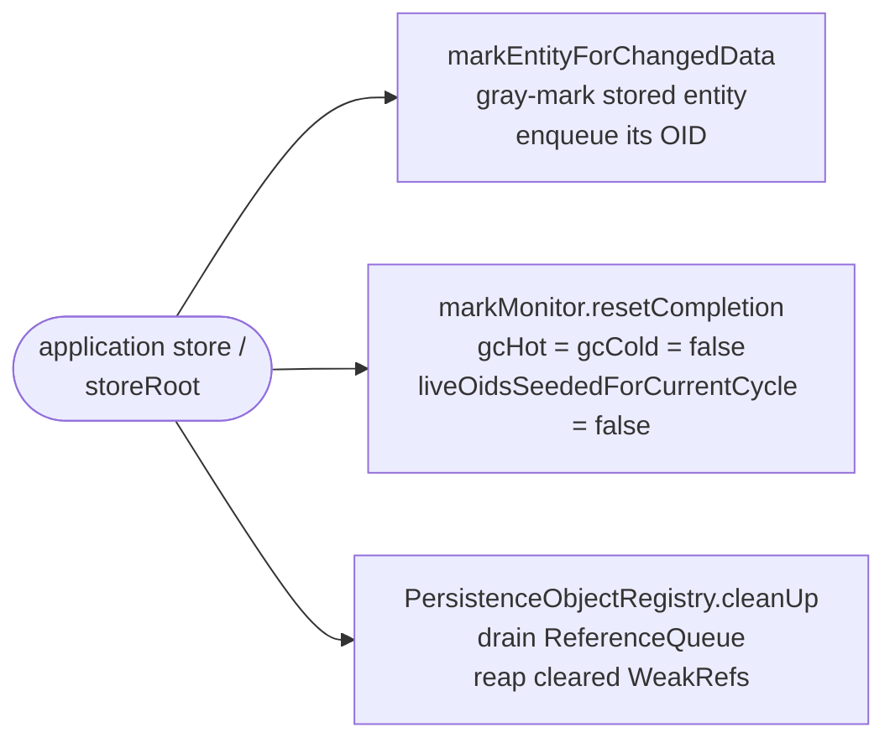
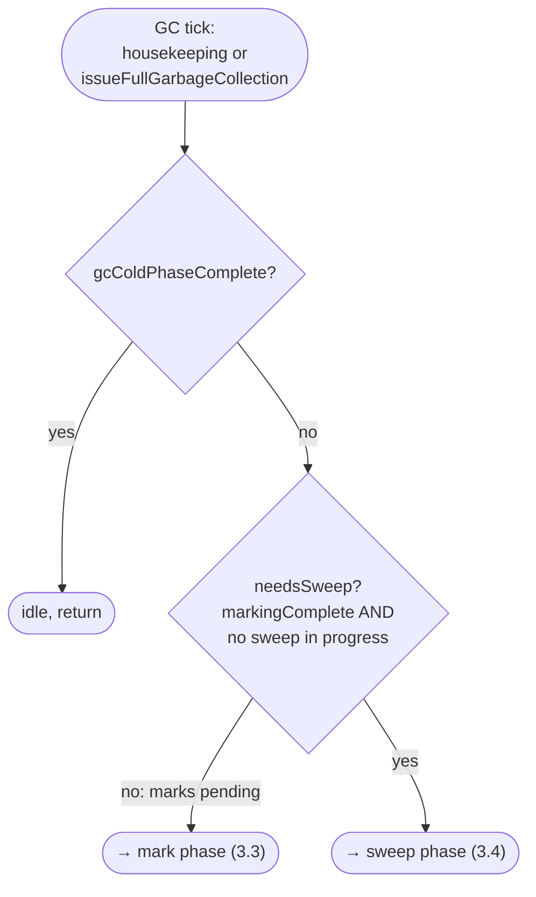
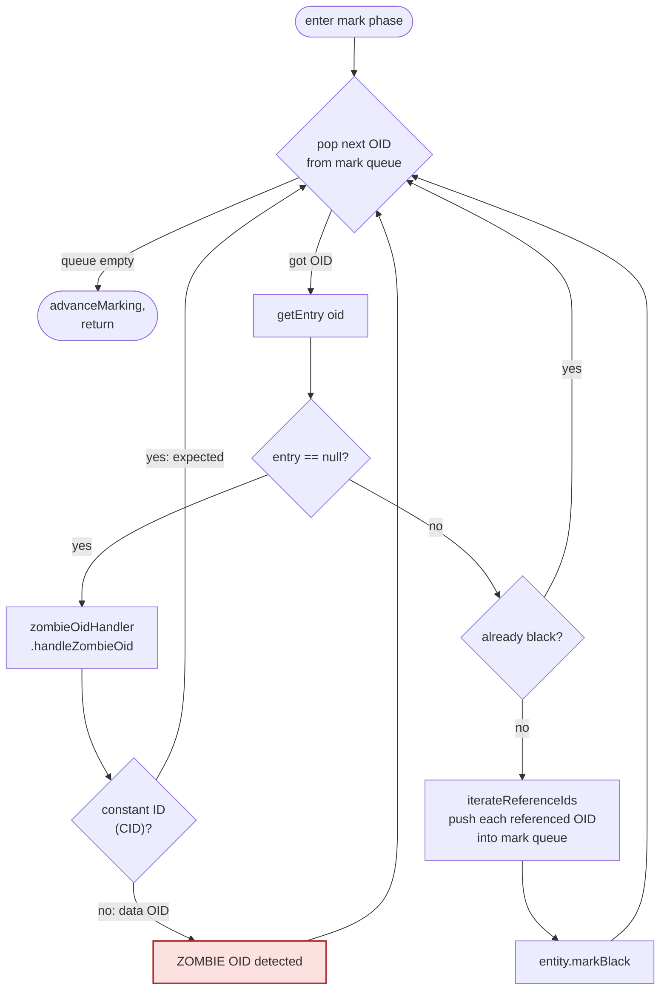
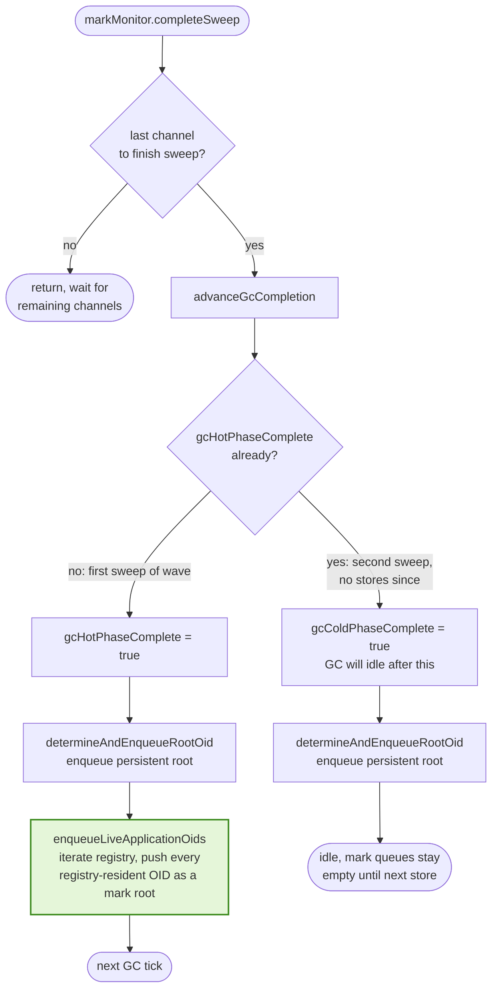
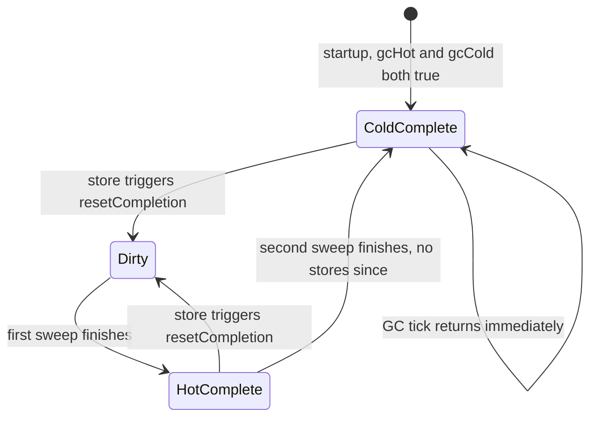

# Storage Garbage Collection

This document describes the EclipseStore storage garbage collector (storage GC), how it cooperates with the JVM's garbage collector, and the two-role *registry safety net* that keeps the persistent graph consistent when the application holds entities the persistent root no longer references.

---

## 1. Purpose

The storage GC reclaims on-disk space occupied by entities that are no longer reachable. Concretely it:

- Walks the persistent object graph starting from the persistent root.
- Marks every reached storage entity (a binary record in a storage channel file).
- Sweeps the entity cache, deleting entries whose binary records are not reachable.
- Triggers file-level compaction for the freed regions.

It is **not** the same thing as the JVM GC. Storage entities live in storage files (and in the per-channel in-memory `StorageEntityCache`); Java objects live on the JVM heap. A single logical datum can exist as *both* a storage entity (binary record + cache entry) and a live Java object — the two are correlated via an **object id** (OID).

Key classes:

| Concern | Class |
|---|---|
| Per-channel entity cache & mark/sweep driver | `StorageEntityCache.Default` |
| Cross-channel mark monitor, OID mark queue, completion state machine | `StorageEntityMarkMonitor.Default` |
| Per-channel mark queue (long[] buffer) | `StorageObjectIdMarkQueue` |
| Dangling-reference callback | `StorageGCZombieOidHandler` |
| Application-registry bridge (combined interface) | `LiveObjectIdsHandler` |
| — sweep filter half of the bridge | `ObjectIdsSelector` (serializer) |
| — mark-seed half of the bridge | `LiveObjectIdsIterator` |
| Embedded-mode implementation of the bridge | `EmbeddedStorageObjectRegistryCallback` |

---

## 2. Two garbage collectors, two domains

There are two independent collectors operating on correlated data:

| Aspect | JVM GC | Storage GC |
|---|---|---|
| Domain | Java heap objects | storage entities (binary records in channel files) |
| Reachability | strong/soft/weak references between Java objects | binary references (OIDs) between entities |
| Roots | thread stacks, statics, JNI, etc. | the persistent root OID; plus app-registry OIDs (see §7) |
| Trigger | JVM heuristics | storage housekeeping + `issueFullGarbageCollection` |
| Reclaims | heap memory | disk space (via file cleanup after sweep) |

These two worlds meet at the **`PersistenceObjectRegistry`**, which maps OIDs to live Java objects. The registry entries are `WeakReference`s — that is what lets JVM GC influence storage GC (see §8).

---

## 3. Mark and sweep

The storage GC is a classic tri-color mark-and-sweep, adapted for concurrent per-channel operation:

### Mark phase

Each channel has a `StorageObjectIdMarkQueue`. The `StorageEntityMarkMonitor` enqueues starting OIDs (see §4 for *what* gets enqueued). `StorageEntityCache.Default.incrementalMark` repeatedly pops an OID, looks up its entity via `getEntry(oid)`, walks that entity's binary references (via `iterateReferenceIds`) and pushes each referenced OID onto the appropriate channel's queue. Marked entities transition white → gray → black.

Critically: if `getEntry(oid)` returns `null`, the OID has no entity — either expected (a TID/CID, see §5) or a **zombie**. Control passes to `StorageGCZombieOidHandler.handleZombieOid(oid)`.

### Sweep phase

When all mark queues drain and `isMarkingComplete()` is true, `callToSweepRequired()` flips each channel into sweep mode. Each channel iterates its own entity cache and, per entity:

```java
// StorageEntityCache.Default#sweep, the keep-alive check:
if (item.isGcMarked() || isReachableInApplication.test(item.objectId)) {
    (last = item).markWhite();           // keep (reset to white for the next cycle)
} else {
    this.deleteEntity(item, sweepType, last);   // delete
}
```

Two things can rescue an entity:
1. It was gc-marked in the preceding mark phase — reachable from the persistent root (or a mark seed).
2. The predicate `isReachableInApplication` returned true — the **registry safety net**.

When the last channel finishes its sweep, `StorageEntityMarkMonitor.Default.completeSweep` seeds the next mark cycle with two complementary sets of roots: `determineAndEnqueueRootOid` enqueues the persistent root, and `enqueueLiveApplicationOids` enqueues every object id the application currently holds (see §9).

### Flowcharts by phase

The GC is easier to grasp one phase at a time. The five diagrams below partition the full tick, followed by a state diagram for the hot/cold flags.

#### 3.1. Store-side preparation

What a `store()` call does to the GC's state — three independent side effects that together "reopen" GC work:



#### 3.2. GC tick dispatch

Every GC tick (`incrementalGarbageCollection`) starts here. The tick either runs one mark slice or one sweep pass — never both in the same tick.



#### 3.3. Mark phase — `incrementalMark`

Pop an OID, resolve it to an entity, walk its binary references, mark black. Zombie detection is the left branch.



#### 3.4. Sweep phase — per channel

Each channel walks its own entity cache and applies the keep-alive predicate.


#### 3.5. Sweep completion and re-seeding the next mark cycle

The transition point between waves. Only the last channel to call `completeSweep` advances the hot/cold flags and re-seeds the persistent root. The application-state mark roots (highlighted in green) are pushed only when there will be another mark cycle to drain them — i.e. the hot-completing path. On the cold-completing path the GC is going idle, so seeding would only park the entire registry in the mark queues until the next store.



### Reading the diagrams together

- **Stores (3.1) are what reset the GC into "work pending" state** — three side effects: enqueue the stored entity, clear completion flags, drain the `ReferenceQueue`.
- **Every tick (3.2) first checks `gcColdPhaseComplete`.** If true, the GC is idle until a store reopens work.
- **A tick either marks (3.3) or sweeps (3.4), not both.** The sweep check gates the branch.
- **Zombie detection (3.3, red)** sits inside the mark loop at `getEntry(oid) == null`. In the mark phase the only expected null lookup is a constant id (CID) — constants are resolved at runtime rather than stored as entities. The default handler silently accepts CIDs and flags anything else as a zombie. (Type ids (TIDs) don't appear in binary references, so they cannot enter the mark queue in practice, but the default handler accepts them too as a defensive catch-all.)
- **The sweep keep-alive predicate (3.4)** is the OR of `isGcMarked()` and `isReachableInApplication(oid)` — that OR is the registry safety net (see §7, §8).
- **Completion + re-seeding (3.5)** establishes the root sets for the next wave. `determineAndEnqueueRootOid` always seeds the persistent root. `enqueueLiveApplicationOids` then pushes every registry-resident OID into the mark queue **only if another mark cycle will run** — i.e. when the wave just hot-completed. On the cold-completing sweep the GC is going idle, so seeding would only park the entire registry in the mark queues until the next store. The seed uses the same id-only criterion as the sweep predicate (3.4), so cleared-but-not-yet-reaped entries (case (b) in §8) are seeded too — see §10.1.

### Phase state diagram (hot / cold)

The hot/cold completion flags are their own little state machine, independent of the per-tick logic above:



- `Dirty` = at least one of hot/cold is `false`; the GC has real work (mark or sweep) to do.
- `HotComplete` = one full mark+sweep has happened since the last store. Unreachable entities from that store are gone, but a second confirmation pass is still owed.
- `ColdComplete` = the confirmation pass has run with no new stores. GC ticks are no-ops until a store reopens work.

`enqueueLiveApplicationOids` runs on the `Dirty → HotComplete` transition (so the cold mark cycle within the wave gets re-seeded application-state roots) but **not** on `HotComplete → ColdComplete`: there is no follow-up mark cycle to drain those OIDs, so seeding would just leave the whole registry resident in the mark queues until the next store. The next wave's pre-sweep gate (§10.2) re-seeds at the start of the next cycle anyway.

---

## 4. Mark roots

The starting set of the mark phase consists of:

- **The persistent root OID** — determined per channel via `StorageRootOidSelector` and unified in `determineAndEnqueueRootOid`. This is what makes the persistent graph traversable at all.
- **Entities marked as "changed"** — when the application stores something, `markEntityForChangedData` gray-marks the stored entity and enqueues its OID. This is how newly-stored or updated data enters the mark cycle.
- **Live application-held OIDs** — at the end of every sweep that does not cold-complete the wave, `enqueueLiveApplicationOids` iterates the `PersistenceObjectRegistry` and enqueues every live OID into the mark queues for the next cycle. (At cold-complete the GC is going idle, so seeding is skipped to keep the queues empty; the next wave's pre-sweep gate re-seeds — §10.) This makes every entity the application currently holds a mark root, so the graph reachable from application state is traversed alongside the graph reachable from the persistent root. See §7–§9.

---

## 5. OID classes: TIDs, CIDs, OIDs

Not every long id in the system maps to a storage entity. `Persistence.IdType` defines four disjoint ranges:

| Range | Meaning | Has storage entity? |
|---|---|---|
| TID | Type id (class metadata) | No — types are resolved at runtime. |
| CID | Constant id (JLS constants) | No — constants are resolved at runtime. |
| OID | Regular object id (data entity) | **Yes** — this is what the storage GC actually tracks. |
| NULL / UNDEFINED | sentinel / invalid | No. |

This matters for mark-time. At mark time, the only realistic "null but expected" case is a **CID**: entity binaries reference constants by id, constants have no storage entity, so `getEntry` returns `null` but this is not a zombie. **TIDs** don't appear in binary references at all (they identify the entity's own type, stored separately in the record header), so they should never enter the mark queue in practice. `StorageGCZombieOidHandler.Default` returns `true` for both as a defensive catch-all, and `EmbeddedStorageObjectRegistryCallback.iterateLiveObjectIds` filters its seed set to `Persistence.IdType.OID` so non-data ids are never fed to the mark queue via the application-state root path.

---

## 6. Hot and cold phases

The mark monitor tracks two completion flags:

- **`gcHotPhaseComplete`** — "no new data has been received since the last sweep". One complete mark+sweep with no stores.
- **`gcColdPhaseComplete`** — "a second sweep has already run since then, so all unreachable entities are gone". One more mark+sweep with no stores after hot completion.

Only cold completion shuts the GC off until the next store. Stores (via `resetCompletion`) reset both flags, kicking the GC back into work.

The reason for two phases: the first sweep after a store cleans up the now-unreachable predecessors; the second sweep confirms the steady state. This two-pass pattern interacts with the registry safety net — which is why application-state OIDs are seeded at **every** sweep boundary that has a follow-up mark cycle (i.e. every sweep boundary except the cold-completing one — see §10.1).

---

## 7. Crossing the JVM boundary: the object registry

`PersistenceObjectRegistry` (in the serializer module) maps OIDs ↔ Java objects. It is the only place where the storage GC can ask "does the application still care about this entity?" Entries are held as `java.lang.ref.WeakReference`s so that keeping an entity in the registry does not prevent the JVM GC from collecting the Java instance when the app drops it.

The embedded wiring exposes the registry to the storage GC via `EmbeddedStorageObjectRegistryCallback`, which implements our combined `LiveObjectIdsHandler` — i.e. both roles described below.

### Two roles the registry plays for the GC

| Aspect | `ObjectIdsSelector` | `LiveObjectIdsIterator` |
|---|---|---|
| Phase | sweep | end of sweep → seed next mark |
| Flow | sweep → registry (ask) | registry → mark queue (push) |
| API style | filter predicate via `ObjectIdsProcessor` | acceptor-based enumeration |
| Keeps alive | the asked-about entity | the entity **and** everything its binary transitively references |
| Purpose | "don't delete what the app still holds" | "make sure what the app holds is traversed" |

See the class-level javadoc on `LiveObjectIdsHandler` for the formal definition.

---

## 8. JVM `WeakReference` semantics and the registry's view of them

This is the most subtle part of the interaction between JVM GC and storage GC. It rests on a three-stage `WeakReference`/`ReferenceQueue` lifecycle that is **JDK behavior**, not Eclipse Store behavior:

1. **Strongly reachable** — `WeakReference.get()` returns the referent.
2. **Only weakly reachable** — the JVM GC *clears* the reference: `get()` starts returning `null`, and the `WeakReference` object itself (not the referent) is enqueued onto its `ReferenceQueue` if one was registered. The `WeakReference` instance remains in whatever container held it.
3. **Queue drained** — some application code polls the queue and removes the `WeakReference` from its container.

Between (2) and (3) there is a window in which a container (here, a hash table) still contains a `WeakReference` whose referent is gone. The JVM does **not** automatically remove weak references from containers — the application has to do it. `java.util.WeakHashMap.expungeStaleEntries()` is the canonical example of this idiom.

### How this plays out in `DefaultObjectRegistry`

```java
static final class Entry extends WeakReference<Object> {
    final long objectId;
    ...
}
```

The hash-table entries **are** the weak references. The registry exposes two contains-style operations:

- `synchContainsObjectId(oid)` — only compares `e.objectId == objectId`. Does **not** call `e.get()`.
- `synchContainsLiveObject(oid)` — returns `e.get() != null`, i.e. verifies the referent is still present.

These are surfaced as the public `containsObjectId(long)` and `containsLiveObject(long)` on `PersistenceObjectRegistry`.

### The predicate the safety net actually uses

`processLiveObjectIds` hands the storage GC this predicate:

```java
// DefaultObjectRegistry.java
processor.processObjectIdsByFilter(this::synchIsLiveObjectId);

final boolean synchIsLiveObjectId(final long objectId) {
    return this.synchContainsObjectId(objectId);    // id-only check
}
```

Despite the name, `synchIsLiveObjectId` delegates to the id-only `synchContainsObjectId`, **not** to `synchContainsLiveObject`. That means the safety-net predicate returns `true` for:

- (a) entries whose Java instance is still strongly reachable, **and**
- (b) entries whose Java instance has already been collected and whose `WeakReference` has been cleared, but whose `Entry` has not yet been removed from the hash table.

Case (b) is exactly the JDK window between stages 2 and 3.

### Why case (b) doesn't cause corruption

Case (b) — a cleared `WeakReference` whose `Entry` has not yet been removed from the hash table — would be dangerous if the **mark seed** and the **sweep predicate** disagreed about whether such an entry counts as live: a parent kept alive by sweep but skipped at mark would leave its stored binary references unwalked, and a transitively-reachable child whose own entry had already been reaped would be deleted while the parent retained the stale OID on disk (a zombie OID on the next mark cycle, see §10.1).

Three mechanisms keep this from happening:

- **Same id-only criterion at both ends.** The post-sweep / pre-sweep mark seed (§10) enumerates *every* data-OID entry in the registry's hash table — including case (b) entries — using the same id-only test (`synchContainsObjectId`) that the sweep keep-alive predicate uses. So the two paths agree on what counts as "registry-resident", and case (b) entries always get their binaries walked transitively before sweep decides what to delete.
- **`DefaultObjectRegistry.cleanUp()` on every storer merge.** `cleanUp()` drains the `ReferenceQueue` and removes cleared entries; it is invoked automatically from `PersistenceObjectManager.synchInternalMergeEntries`. In write-heavy workloads this collapses case (b) within milliseconds of any store.
- **`DefaultObjectRegistry.consolidate()` on the issue-API GC path.** `StorageConnection.Default#issueGarbageCollection` calls `consolidate()` before kicking off the GC; `consolidate()` walks the entire hash table and removes every cleared entry up front. This is **not** done on the housekeeping GC path — which is precisely why aligning the mark-seed criterion with the sweep predicate (the first mechanism above) matters: the housekeeping path would otherwise be the only place case (b) can be observed by the GC, and a mark/sweep disagreement there would corrupt data even if `cleanUp()` happens to run on the next store.

### Sources

- JDK class javadoc of `java.lang.ref.WeakReference`, `java.lang.ref.Reference`, `java.lang.ref.ReferenceQueue` — spells out that the GC clears and enqueues but does not remove from user containers.
- JDK source of `java.util.WeakHashMap.expungeStaleEntries()` — the canonical "poll-the-queue and unlink" idiom that `DefaultObjectRegistry.cleanUp()` mirrors.
- Eclipse Serializer source: `DefaultObjectRegistry.java` — `Entry extends WeakReference` (class declaration), `synchContainsObjectId`, `synchContainsLiveObject`, `processLiveObjectIds`, `cleanUp`, `consolidate`.

---

## 9. Design rationale: why two registry roles

The two registry-access roles in §7 are not redundant; each targets a distinct class of reachability that the other cannot cover.

- `ObjectIdsSelector` answers **"is this entity still needed?"** at sweep time. It protects an individual entity whose Java instance is currently held, even when the persistent graph no longer reaches it.
- `LiveObjectIdsIterator` answers **"what is reachable from application state?"** at mark time. It promotes every app-held entity to a mark root, so the mark phase walks the entity's binary references transitively.

### Why the sweep-time role alone would be insufficient

A sweep-time keep-alive check is *shallow*: it rescues the asked-about entity but not the entities that entity's binary record points to. The following scenario walks through what would happen with only the sweep-time role active:

1. Application stores `root → Holder → Payload`. All three entities exist in the cache and registry.
2. Application removes `Holder` from root's graph (`root.holder = null; storeRoot()`). Root's binary no longer references Holder. Holder's Java object is still alive in the app, so its registry entry stays. Holder's stored binary still references Payload's OID.
3. Application drops its Java reference to Payload. JVM GC clears Payload's `WeakReference`. A subsequent store triggers `cleanUp()`, which reaps Payload's entry from the registry.
4. Storage GC cycle runs.
   - Mark: starts from the persistent root. Root doesn't reference Holder, so without the iterator role neither Holder nor Payload would be marked.
   - Sweep: Holder is not marked but *is* in the registry → sweep-time safety net keeps it. Payload is not marked and *not* in the registry → Payload is deleted. Holder's stored binary still references Payload's OID.
5. Application re-attaches Holder to root (`root.holder = holderRef; storeRoot()`). The lazy storer notices Holder is already registered and **skips re-serializing it** (`BinaryStorer.Default.internalStore`: if `lookupOid(root) != notFound` return early). Holder's binary record is not rewritten — it still references the now-deleted Payload OID.
6. Next storage GC cycle.
   - Mark: root → Holder → iterate Holder's refs → `getEntry(payloadOid)` returns `null` → zombie OID, and on shutdown + reload `StorageExceptionConsistency: No entity found for objectId N`.

Three properties conspire to make this possible: the sweep-time safety net is shallow (keeps the entity but not its references), the lazy storer skips already-registered objects (so Holder's binary is never rewritten), and the JVM reaps Payload's registry entry between the two storage-GC cycles.

### How the mark-time role resolves it

`LiveObjectIdsIterator` promotes Holder to a mark root in step 4's mark phase. The marker then walks Holder's binary references and marks Payload — so Payload survives the sweep, Holder's binary stays valid, and no zombie ever arises. The two roles together cover both classes of reachability: the persistent-graph roots via `determineAndEnqueueRootOid`, and the application-state roots via `enqueueLiveApplicationOids`.

The sweep-time role remains as defense in depth for the narrow race of an OID entering the registry between mark and sweep of the same cycle.

---

## 10. Implementation of mark-time registry seeding

Application-state mark roots are seeded into the mark queues at **two** points around every sweep boundary. Together they ensure that an entity kept alive only by the registry safety net always has its transitive binary references walked **before** the next sweep decides what to delete.

### 10.1. Post-sweep seed (primary, runs at every non-cold-completing sweep)

At the end of every sweep (`StorageEntityMarkMonitor.Default.completeSweep`), immediately after `determineAndEnqueueRootOid` seeds the persistent root, `enqueueLiveApplicationOids` pushes every currently-live registry OID into the mark queues — but only when there will be another mark cycle to drain them:

```java
// StorageEntityMarkMonitor.Default#completeSweep (simplified)
this.advanceGcCompletion();                         // may flip gcColdPhaseComplete
this.determineAndEnqueueRootOid(rootOidSelector);
if(!this.gcColdPhaseComplete)
{
    this.enqueueLiveApplicationOids(liveObjectIdsIterator);
}
```

The iterator (`EmbeddedStorageObjectRegistryCallback.iterateLiveObjectIds`) walks the registry's `iterateEntries` and emits every data-OID entry (`Persistence.IdType.OID.isInRange(objectId)`). The id-only criterion deliberately matches the sweep keep-alive predicate (`DefaultObjectRegistry#synchIsLiveObjectId` → `synchContainsObjectId`); cleared-but-not-yet-reaped entries (case (b) in §8) are seeded as mark roots even though their `WeakReference.get()` returns `null`, because the sweep predicate keeps them alive too — skipping them at mark time would leave their stored binary references unwalked and create a zombie window on the housekeeping GC path. TIDs and CIDs are excluded so they never reach the zombie handler.

#### Why the cold-complete branch skips the seed

After the cold-completing sweep there is no follow-up mark cycle: `gcColdPhaseComplete` is now `true`, the housekeeping loop short-circuits via `isComplete(channel)` and stops calling `incrementalMark`, and `resetCompletion` does not clear the per-channel mark queues. If `enqueueLiveApplicationOids` ran here, the entire registry — potentially millions of `long`s in the per-channel `StorageObjectIdMarkQueue` segments — would sit resident in the queues until the next store reopens work. This made idle GC memory scale with the application-held set rather than with actual GC work in flight, and was the issue raised in PR review of #669.

The skip costs nothing: the next wave starts with `resetCompletion` (which clears `liveOidsSeededForCurrentCycle`), and the pre-sweep gate (§10.2) re-seeds the registry on the very first sweep of that wave. So application-state mark roots are still established at every cycle that actually marks.

So the seed runs on `Dirty → HotComplete` (the cold mark cycle within the wave gets app-state roots) but is skipped on `HotComplete → ColdComplete` (idle transition).

### 10.2. Pre-sweep gate + registration-version check

`completeSweep` runs *after* a sweep has already executed. That means it cannot protect the very first sweep of a freshly-armed GC cycle, when no prior post-sweep seed exists yet (e.g. cycle 0 right after startup, or any cycle following a `resetCompletion()` triggered by a store). And a seed that *did* run can be **stale** by sweep time: the application can register new objects (most importantly by *loading* them) after the seed ran — the mid-cycle registration race, §10.4.

To close both gaps, `callToSweepRequired` runs a **seed/verify loop** before every sweep initiation:

```java
// StorageEntityMarkMonitor.Default#callToSweepRequired (simplified)
if(this.liveObjectIdsIterator != null)
{
    while(!this.liveOidsSeededForCurrentCycle
        || this.liveObjectIdsIterator.registrationVersion() != this.seedRegistrationVersion
    )
    {
        this.liveOidsSeededForCurrentCycle = true;
        // snapshot BEFORE iterating: a registration racing with the seed is either
        // included in the iteration or bumps the version past the snapshot and is
        // caught by the next compare. Snapshot-after-seed could miss one forever.
        this.seedRegistrationVersion = this.liveObjectIdsIterator.registrationVersion();
        this.enqueueLiveApplicationOids(this.liveObjectIdsIterator);

        // If seeding raised pendingMarksCount, marking is no longer complete:
        // tell the caller to keep marking before the sweep is initiated.
        if(!this.isMarkingComplete())
        {
            return false;
        }
        // Otherwise (empty registry / all already marked) the loop re-checks
        // version stability, then falls through to sweep.
    }
}
```

The `liveOidsSeededForCurrentCycle` flag now means "the seed ran *at least once* this cycle" (set here, cleared on every store via `resetCompletion()` and on every channel reset via `initialize()`); the *staleness* of the seed is guarded separately by the registration-version compare. That means:

- The hot-phase pre-sweep fires on cycle entry → registry-only-kept entities become mark roots before any sweep runs.
- The cold-phase pre-sweep does not re-fire via the flag (the post-hot-sweep seed (10.1) already established the mark roots), but the **version compare still runs** at the cold sweep's initiation — registrations landing between the hot sweep and the cold sweep are caught against the snapshot taken by the post-sweep seed.

The `resetMarkQueues()` invariant (which throws if any queue still has elements) is preserved: seeding either drains in the next mark slice (returning `false` here) or contributes zero new OIDs; only when the queues are empty does control reach `resetMarkQueues` + `initiateSweep`. Termination: a seed of a non-empty registry raises `pendingMarksCount` and returns `false`, so the loop body only repeats immediately when the seed enqueued nothing — at most a couple of iterations per call.

### 10.3. Why both, and not just one

| Boundary | Covered by | Reason the other isn't enough |
|---|---|---|
| First (hot) mark/sweep of a wave (wave 0 or post-`resetCompletion`) | pre-sweep gate (10.2) | post-sweep seed has not run yet in this wave |
| Cold mark/sweep within the same wave | post-sweep seed at hot completion (10.1) | gate flag stays set for the rest of the wave; without 10.1 the cold mark phase would seed from no-one |
| After cold completion (idle until next store) | nothing — by design | no follow-up mark cycle, so seeding would only park the registry in the mark queues; the next wave's pre-sweep gate (10.2) re-seeds when work resumes |
| Race: OID enters registry between the seed and the sweep *initiation* | registration-version compare in the 10.2 seed/verify loop (both hot and cold sweep initiations) | the shallow sweep predicate alone is NOT enough: a *loaded* entity's binary can reference children that were neither loaded nor registered (e.g. an unloaded `Lazy`'s target) — see §10.4 |
| Race: OID enters registry after sweep *initiation*, before/between per-channel sweeps | sweep-time `ObjectIdsSelector` predicate (shallow safety net) only — **residual window**, see §10.4 | entities *stored* in that window are safe anyway (store-time gray-marks + `resetCompletion`); entities *loaded* in that window are the remaining theoretical exposure; per-channel sweeps themselves run under the registry mutex, so no interleaving within a channel |
| Case (b) entry (cleared `WeakReference`, hash-table entry not yet reaped) on the housekeeping GC path | id-only criterion shared by 10.1 / 10.2 mark seed and 3.4 sweep predicate | the housekeeping path calls neither `cleanUp()` (only fires on storer-merge) nor `consolidate()` (only fires on `issueGarbageCollection`); without the shared criterion, sweep would keep the case (b) entry while mark skipped it, leaving its stored binary references unwalked — see §8 |

### 10.4. The mid-cycle registration race

Found 2026-07-03, reproduced deterministically by `MidCycleRegistrationRaceTest` (integration-tests, `test.eclipse.store.gc`). The failure chain, with an orphaned on-disk graph `X(Parent) → L(unloaded Lazy) → Y(Payload)` whose Java instances were collected and reaped from the registry:

1. A GC cycle runs its live-OID seed — X/L/Y are not in the registry, so none is seeded or marked.
2. The application **loads X by OID** (retained id, stale navigation, `Lazy.get()`). The load registers X and its eagerly built — but unloaded — Lazy instance L in the registry, *after* the seed, *before* the sweep. Y is never registered: an unloaded Lazy does not build its target.
3. Sweep: X and L survive via the shallow id-only predicate; Y (white, unregistered) is deleted. L's persisted binary now references a nonexistent entity.
4. Next mark walks L's record → zombie OID; the next reload / `Lazy.get()` throws `StorageExceptionConsistency: No entity found for objectId Y`.

The former §10.3 justification for this window ("the entity's binary was just loaded and is consistent, no transitivity needed") is exactly what step 2 disproves: the binary *is* consistent, but its referenced child is neither loaded, registered, nor marked.

**The fix consists of two complementary layers:**

**Layer 1 — load-side marking + pending-load gate** (primary for loads): `StorageChannel.collectLoadByOids/Tids` signal a *pending load* on the mark monitor for the duration of the collection (`pendingLoadCount` participates in `isMarkingComplete()`, so no sweep can be *initiated* mid-load), and every entity handed out by a load is marked like changed data via `StorageEntityCache#markEntityForLoadedData` — gray-marked and enqueued (references walked transitively) during an active mark phase, black-marked if a sweep was already initiated. This protects the loaded graph **at hand-out time**, i.e. even before the application-side `BinaryLoader` registration happens — a gap the registry-based layer below cannot see.

**Layer 2 — the registration-version check** of §10.2 (covers ALL registration paths, including direct `registerObject` calls that never pass through the load collectors — import tooling, communication, application code):

- `DefaultObjectRegistry` (serializer) increments a `volatile long registrationVersion` at its single new-association choke point (`synchPutNewEntry`) — all register paths funnel there, including re-binding an id whose weak entry was cleared; lookups, updates and removals do not count (a removal cannot make an unmarked entity rescuable).
- Reading the version never touches the registry mutex: `DefaultObjectRegistry#registrationVersion()` is a plain volatile read (the embedded callback wrapper `EmbeddedStorageObjectRegistryCallback#registrationVersion()` synchronizes on the callback itself for its late-init pattern, not on the registry), so the mark monitor's compare cannot contend with application-side registrations.
- The monitor snapshots the version at **both** seed sites (pre-sweep gate 10.2 and post-sweep seed 10.1) and compares before every sweep initiation; a mismatch re-runs the seed and lets the mark phase drain the new roots transitively before any deletion.

Trade-offs and boundaries:

- **Starvation**: continuous registrations defer the sweep indefinitely across calls — the same trade-off as continuous stores deferring completion via `resetCompletion()`. Deliberately unbounded: sweeping with a stale seed would re-open the race.
- **Custom registries**: `PersistenceObjectRegistry#registrationVersion()` defaults to a constant `0` ("registrations never observable") — correct for registries that never gain entries (e.g. the REST adapter's disabled registry), but runtime-mutable custom implementations must override it or they keep pre-fix behavior.
- **Residual window (honestly)**: both layers act before sweep *initiation*. A load or registration landing after `initiateSweep()` but before/between the per-channel sweeps is still covered only by the shallow predicate (layer 1's `hasLoadPendingSweep` branch black-marks the handed-out entity itself, but cannot rescue its not-yet-loaded children — e.g. an unloaded Lazy's target — in that already-initiated sweep). This cannot be fully closed post-hoc — a channel may already have deleted the child. Mitigating: each channel's entire sweep runs under the registry mutex (registrations cannot interleave *within* a channel sweep), so the residual exposure is the initiation→first-sweep gap and the between-channel gaps in multi-channel setups — orders of magnitude narrower than the whole mark phase, and not reachable via the load path the test exercises. A further hardening (version check at sweep entry + cooperative wave abort) is possible but changes wave-state invariants and is deliberately not part of this fix.

### Interface layering

- `ObjectIdsSelector` (serializer) — sweep-time filter protocol.
- `LiveObjectIdsIterator` (this module) — mark-time enumeration protocol.
- `LiveObjectIdsHandler extends ObjectIdsSelector, LiveObjectIdsIterator` (this module) — combined interface the storage GC plumbing uses.
- `EmbeddedStorageObjectRegistryCallback extends LiveObjectIdsHandler` — embedded-mode implementation, backed by `PersistenceObjectRegistry`.

Internal wiring (`StorageFoundation`, `StorageSystem`, `StorageChannelsCreator`, `StorageEntityCache`) carries `LiveObjectIdsHandler` end to end, so the GC holds both capabilities in one typed reference.

---

## 11. Quick reference

Read these together to see the full picture:

- `StorageEntityCache.Default` — `sweep(_longPredicate)` (the safety-net keep-alive check), `incrementalMark` (the zombie detection site), `liveObjectIdsHandler` field.
- `StorageEntityMarkMonitor.Default` — `completeSweep`, `determineAndEnqueueRootOid`, `enqueueLiveApplicationOids`, `acceptObjectId`/`enqueue`.
- `LiveObjectIdsHandler` — class-level javadoc giving the role-by-role comparison.
- `EmbeddedStorageObjectRegistryCallback.Default` — `processSelected` (sweep filter) and `iterateLiveObjectIds` (mark seeding).
- `DefaultObjectRegistry` (serializer) — `Entry extends WeakReference`, `synchContainsObjectId` vs `synchContainsLiveObject`, `processLiveObjectIds`, `cleanUp` (drains the `ReferenceQueue`, called from `PersistenceObjectManager.synchInternalMergeEntries`), `consolidate` (walks the entire hash table and reaps every cleared entry, called from `StorageConnection.Default#issueGarbageCollection`).
- `StorageGCZombieOidHandler.Default` — expected-null filter for TID/CID lookups, reporting path for any other null lookup.
- `Persistence.IdType` (serializer) — TID / OID / CID range predicates.
